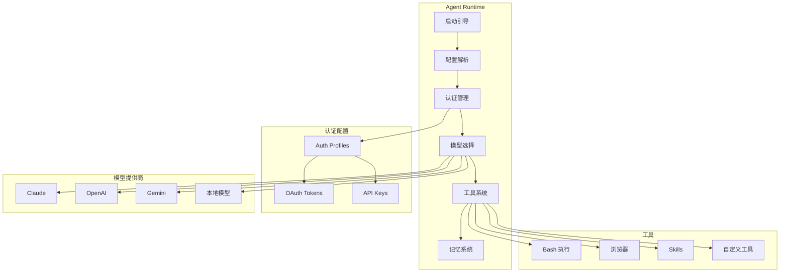
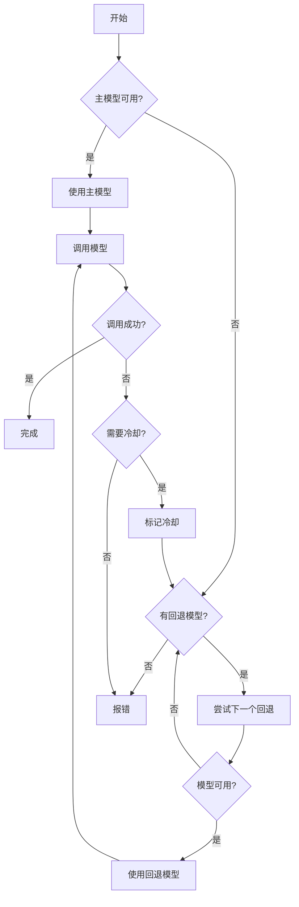
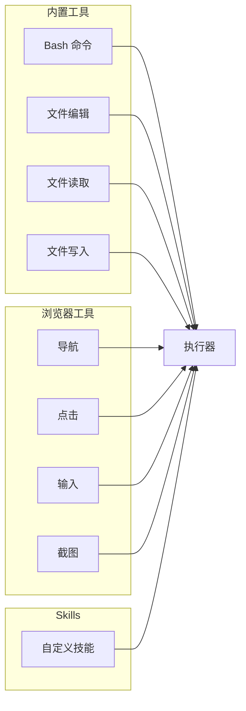
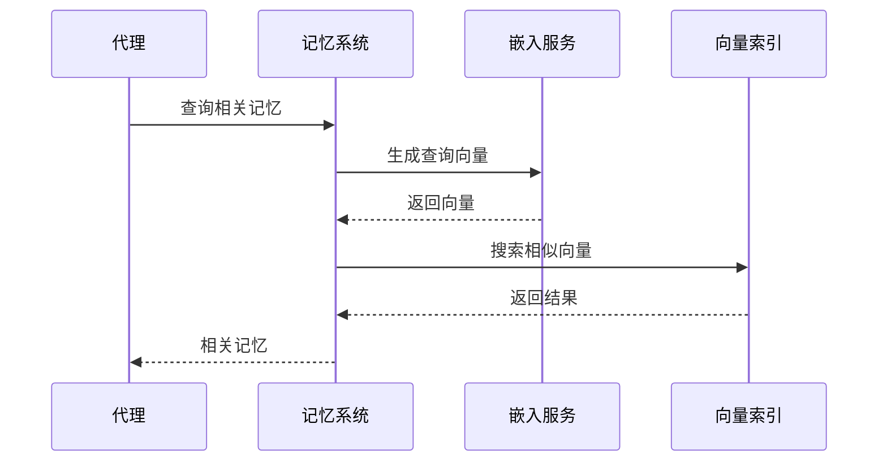
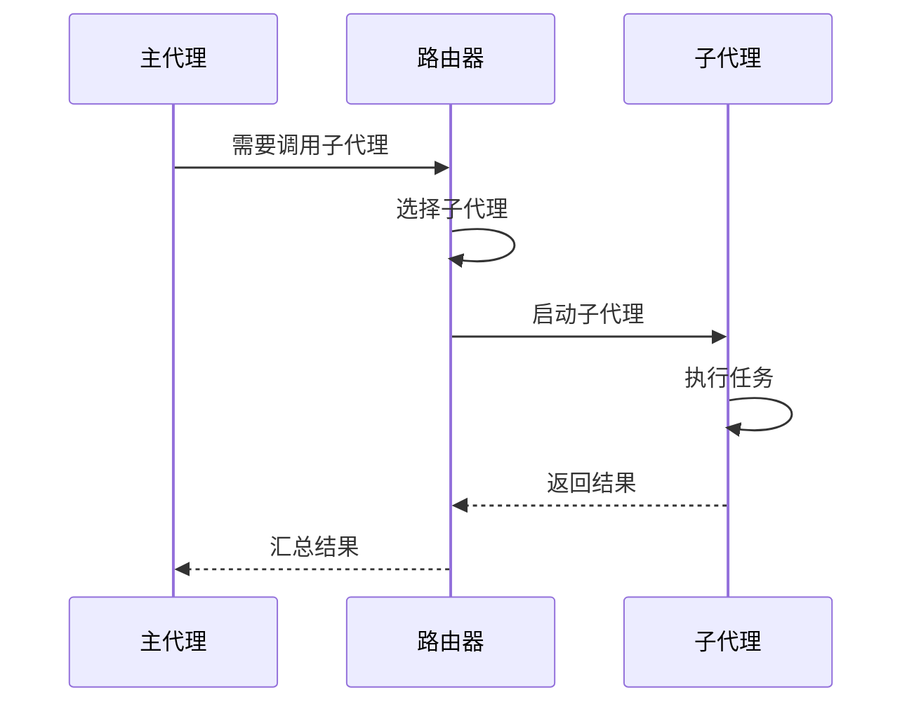

# Agents 代理

Agents 模块是 AI 代理的运行时环境，负责模型选择、工具调用和对话管理。

## 架构概览



## 代理配置

### 配置结构

```typescript
interface AgentEntry {
  // 基本信息
  id: string;
  name?: string;
  default?: boolean;

  // 模型配置
  model?: string | ModelConfig;

  // 工作空间
  workspace?: string;
  agentDir?: string;

  // 能力配置
  skills?: string[];
  tools?: ToolsConfig;
  memorySearch?: MemorySearchConfig;

  // 身份配置
  identity?: AgentIdentity;

  // 子代理
  subagents?: SubagentConfig;

  // 沙箱配置
  sandbox?: SandboxConfig;

  // 行为配置
  humanDelay?: HumanDelayConfig;
  heartbeat?: HeartbeatConfig;
  groupChat?: GroupChatConfig;
}
```

### 模型配置

```typescript
interface ModelConfig {
  primary: string;           // 主模型
  fallbacks?: string[];      // 回退模型列表
}

// 配置示例
{
  "model": {
    "primary": "claude-sonnet-4-20250514",
    "fallbacks": ["gpt-4o", "gemini-2.0-flash"]
  }
}
```

## 模型选择

### 选择流程



### 冷却机制

当模型调用失败时，会进入冷却状态：

```typescript
interface CooldownState {
  reason: CooldownReason;
  expiresAt: number;
  failureCount: number;
}

type CooldownReason =
  | 'rate_limit'
  | 'billing_error'
  | 'context_overflow'
  | 'unknown';
```

### Auth Profiles

认证配置管理不同 API 提供商的凭据：

```typescript
interface AuthProfile {
  provider: string;         // anthropic | openai | google | ...
  label?: string;           // 显示标签

  // 认证方式
  apiKey?: string;          // API Key
  oauth?: OAuthState;       // OAuth 状态

  // 状态
  lastUsed?: number;
  lastGood?: number;
  cooldown?: CooldownState;
}
```

## 工具系统

### 工具类型



### Bash 工具

Bash 工具执行 shell 命令：

```typescript
interface BashToolParams {
  command: string;          // 命令
  timeout?: number;         // 超时时间
  background?: boolean;     // 后台执行
  workdir?: string;         // 工作目录
  env?: Record<string, string>;  // 环境变量
}
```

安全机制：
- 命令白名单
- 执行审批
- 沙箱隔离
- 超时保护

### 浏览器工具

浏览器自动化工具集：

| 工具 | 描述 |
|------|------|
| `browser_navigate` | 导航到 URL |
| `browser_click` | 点击元素 |
| `browser_type` | 输入文本 |
| `browser_screenshot` | 截取屏幕 |
| `browser_scroll` | 滚动页面 |
| `browser_wait` | 等待条件 |

## Skills 技能系统

### Skill 结构

```
~/.openclaw/skills/{skillName}/
├── skill.md          # 提示词
├── tools.json        # 工具定义
├── config.json       # 配置
└── files/            # 附加文件
```

### Skill 加载


### Skill 配置

```typescript
interface SkillConfig {
  name: string;
  description: string;
  tools?: ToolDefinition[];
  prompt?: string;
  files?: string[];
}
```

## 记忆系统

### 向量搜索



### 配置

```typescript
interface MemorySearchConfig {
  enabled: boolean;
  embeddingModel?: string;
  topK?: number;
  threshold?: number;
}
```

## 子代理系统

### 子代理调用



### 子代理配置

```typescript
interface SubagentConfig {
  [name: string]: {
    model?: string;
    skills?: string[];
    tools?: string[];
    systemPrompt?: string;
  };
}
```

## 身份配置

### Agent Identity

```typescript
interface AgentIdentity {
  name?: string;              // 名称
  bio?: string;               // 简介
  personality?: string;       // 性格
  expertise?: string[];       // 专业领域
  communication_style?: string;  // 沟通风格
}
```

### 提示词模板

系统提示词由以下部分组成：

1. **身份提示**: 基于 identity 配置
2. **技能提示**: 加载的 Skills
3. **工具描述**: 可用工具列表
4. **上下文**: 对话历史和环境信息

## 沙箱配置

### 沙箱选项

```typescript
interface SandboxConfig {
  enabled: boolean;
  workdir?: string;           // 工作目录
  allowCommands?: string[];   // 允许的命令
  denyCommands?: string[];    // 禁止的命令
  env?: Record<string, string>;
  timeout?: number;
}
```

### 权限控制

- 文件系统访问限制
- 网络访问控制
- 命令执行白名单
- 资源使用限制