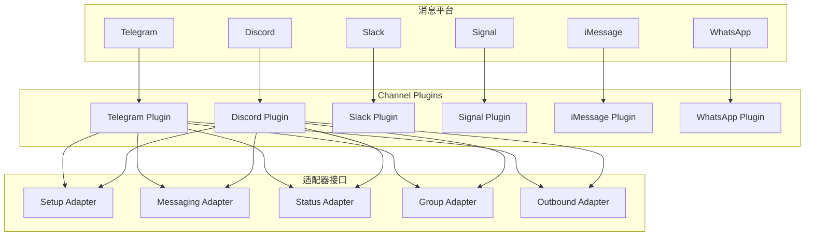
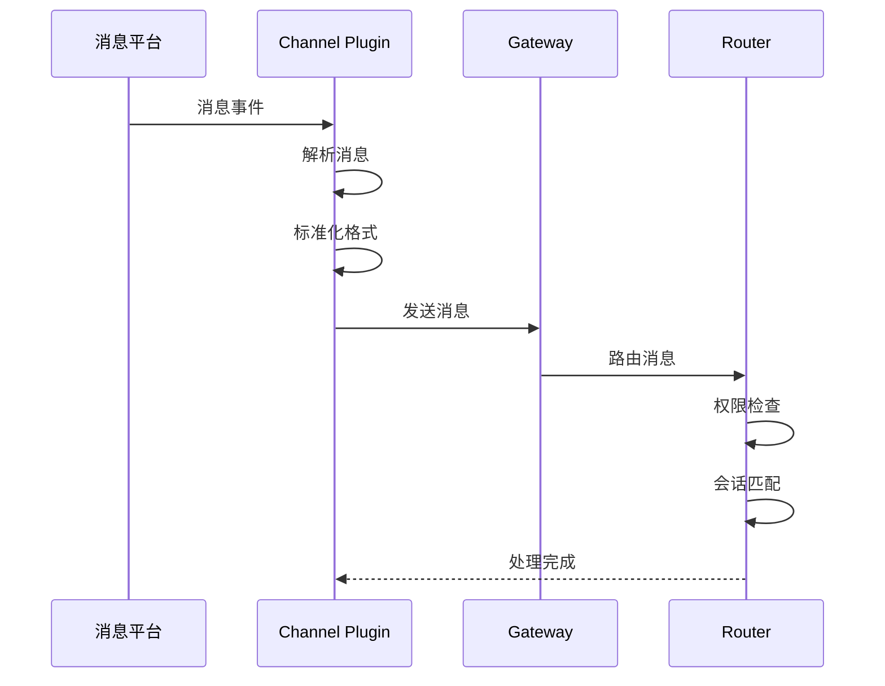
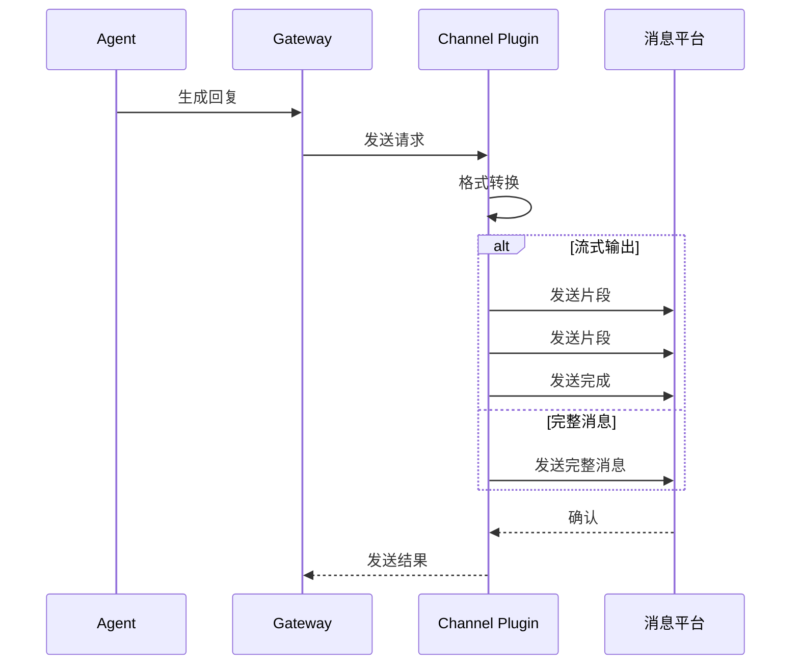
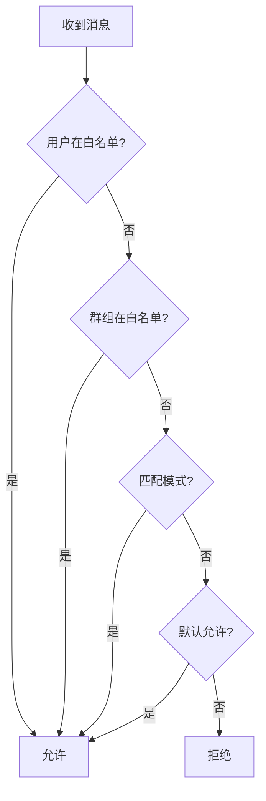

# Channels 渠道

Channels 模块通过适配器模式统一不同消息平台的接口，支持 Telegram、Discord、Slack、Signal、iMessage、WhatsApp 等。

## 架构概览



## Channel Plugin 接口

### 核心类型

```typescript
interface ChannelPlugin {
  id: ChannelId;
  meta: ChannelMeta;

  // 适配器
  setup?: ChannelSetupAdapter;
  messaging?: ChannelMessagingAdapter;
  status?: ChannelStatusAdapter;
  group?: ChannelGroupAdapter;
  outbound?: ChannelOutboundAdapter;
  pairing?: ChannelPairingAdapter;
  security?: ChannelSecurityAdapter;
  threading?: ChannelThreadingAdapter;
  streaming?: ChannelStreamingAdapter;
  heartbeat?: ChannelHeartbeatAdapter;
  elevated?: ChannelElevatedAdapter;
  mention?: ChannelMentionAdapter;
  directory?: ChannelDirectoryAdapter;
  config?: ChannelConfigAdapter;
  command?: ChannelCommandAdapter;
  resolver?: ChannelResolverAdapter;
  tools?: ChannelAgentTool[];
}
```

### 元数据

```typescript
interface ChannelMeta {
  displayName: string;
  order?: number;
  icon?: string;
  description?: string;
  website?: string;
  features?: {
    groups?: boolean;
    mentions?: boolean;
    threads?: boolean;
    streaming?: boolean;
    files?: boolean;
    images?: boolean;
    audio?: boolean;
    video?: boolean;
  };
}
```

## 适配器详解

### Setup Adapter

渠道初始化和配置：

```typescript
interface ChannelSetupAdapter {
  // 配置 Schema
  configSchema?: ChannelConfigSchema;

  // 初始化
  setup?(input: ChannelSetupInput): Promise<void>;

  // 验证配置
  validate?(config: unknown): Promise<boolean>;
}
```

### Messaging Adapter

消息收发核心接口：

```typescript
interface ChannelMessagingAdapter {
  // 接收消息
  poll?(ctx: ChannelPollContext): Promise<ChannelPollResult>;

  // 发送消息
  send?(ctx: ChannelOutboundContext): Promise<void>;

  // 消息操作
  edit?(ctx: ChannelOutboundContext): Promise<void>;
  delete?(ids: string[]): Promise<void>;
}
```

### Status Adapter

渠道状态查询：

```typescript
interface ChannelStatusAdapter {
  // 获取状态
  status?(): Promise<ChannelAccountSnapshot>;

  // 健康检查
  probe?(): Promise<BaseProbeResult>;

  // 问题列表
  issues?(): Promise<ChannelStatusIssue[]>;
}
```

### Group Adapter

群组管理：

```typescript
interface ChannelGroupAdapter {
  // 获取群组列表
  listGroups?(): Promise<ChannelDirectoryEntry[]>;

  // 获取成员列表
  listMembers?(groupId: string): Promise<ChannelDirectoryEntry[]>;

  // 群组操作
  addMember?(groupId: string, userId: string): Promise<void>;
  removeMember?(groupId: string, userId: string): Promise<void>;
}
```

### Outbound Adapter

出站消息处理：

```typescript
interface ChannelOutboundAdapter {
  // 发送消息
  send?(ctx: ChannelOutboundContext): Promise<SendResult>;

  // 流式发送
  stream?(ctx: ChannelOutboundContext): AsyncGenerator<StreamChunk>;

  // 回复消息
  reply?(ctx: ChannelOutboundContext, replyTo: string): Promise<void>;
}
```

### Security Adapter

安全策略：

```typescript
interface ChannelSecurityAdapter {
  // 私信策略
  dmPolicy?(ctx: ChannelSecurityContext): Promise<SecurityDecision>;

  // 群组策略
  groupPolicy?(ctx: ChannelSecurityContext): Promise<SecurityDecision>;
}

type SecurityDecision =
  | { allow: true }
  | { allow: false; reason: string };
```

## 消息处理流程

### 入站消息



### 出站消息



## 白名单系统

### Allowlist 配置

```typescript
interface AllowlistConfig {
  // 允许的用户
  users?: string[];

  // 允许的群组
  groups?: string[];

  // 允许的模式
  patterns?: string[];

  // 默认策略
  defaultAllow?: boolean;
}
```

### 匹配逻辑



## 命令门控

### 命令前缀

```
!command    # 标准命令前缀
/command    # Slack 风格
.command    # Discord 风格
```

### 门控配置

```typescript
interface CommandGatingConfig {
  // 启用的命令
  enabled: string[];

  // 命令权限
  permissions: Record<string, {
    users?: string[];
    groups?: string[];
    roles?: string[];
  }>;
}
```

## 线程支持

### Threading Adapter

```typescript
interface ChannelThreadingAdapter {
  // 创建线程
  createThread?(parentId: string, name?: string): Promise<string>;

  // 获取线程消息
  getThreadMessages?(threadId: string): Promise<Message[]>;

  // 线程绑定
  bindThread?(threadId: string, sessionKey: string): Promise<void>;
}
```

### Discord 线程绑定

Discord 支持将线程绑定到特定代理：

```typescript
interface ThreadBindingRecord {
  channelId: string;
  threadId: string;
  sessionKey: string;
  agentId: string;
}
```

## 流式输出

### Streaming Adapter

```typescript
interface ChannelStreamingAdapter {
  // 支持流式
  supported: boolean;

  // 流式发送
  streamStart(ctx: StreamContext): Promise<string>;
  streamChunk(id: string, chunk: string): Promise<void>;
  streamEnd(id: string): Promise<void>;
}
```

### 流式输出策略

对于不支持流式的平台：
1. 缓存完整回复
2. 分批发送
3. 使用编辑功能更新消息

## 心跳机制

### Heartbeat Adapter

```typescript
interface ChannelHeartbeatAdapter {
  // 发送心跳
  sendHeartbeat(ctx: ChannelHeartbeatDeps): Promise<void>;

  // 心跳间隔
  intervalMs?: number;
}
```

### 心跳用途

- 表明代理在线
- 显示当前状态
- 指示处理进度

## 配置 Schema

### 渠道配置

```typescript
interface ChannelConfigSchema {
  // JSON Schema
  type: 'object';
  properties: Record<string, SchemaProperty>;
  required?: string[];

  // UI 提示
  ui?: {
    order?: string[];
    groups?: ConfigGroup[];
  };
}
```

### 配置示例

```json
{
  "telegram": {
    "token": "YOUR_BOT_TOKEN",
    "allowFrom": ["user1", "user2"],
    "commands": {
      "enabled": ["help", "status"]
    }
  }
}
```