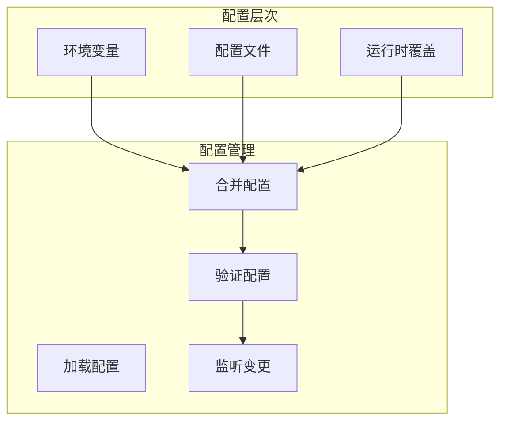
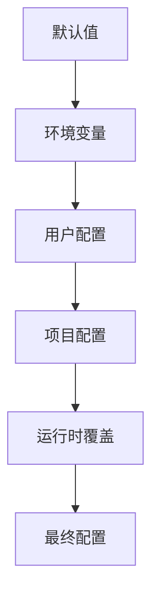
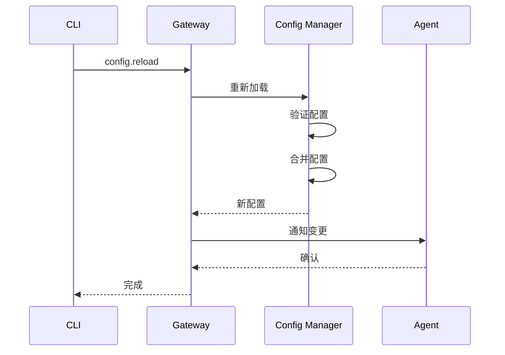

# Config 配置

Config 模块管理 OpenClaw 的配置系统，支持分层配置和热重载。

## 概述



## 配置文件

### 文件位置

```
~/.openclaw/config.json        # 主配置文件
./openclaw.json                # 项目配置（优先级更高）
```

### 配置结构

```typescript
interface OpenClawConfig {
  // 模型配置
  model?: {
    primary?: string;
    fallbacks?: string[];
  };

  // 代理配置
  agents?: {
    list?: AgentEntry[];
    defaults?: {
      model?: ModelConfig;
      skills?: string[];
    };
  };

  // 渠道配置
  telegram?: TelegramConfig;
  discord?: DiscordConfig;
  slack?: SlackConfig;
  signal?: SignalConfig;
  imessage?: iMessageConfig;
  whatsapp?: WhatsAppConfig;

  // 网关配置
  gateway?: {
    bind?: 'loopback' | 'all';
    port?: number;
    password?: string;
  };

  // 安全配置
  security?: {
    allowFrom?: string[];
    commandGating?: CommandGatingConfig;
  };

  // 工具配置
  tools?: ToolsConfig;

  // 记忆配置
  memory?: MemoryConfig;
}
```

## 配置层次

### 优先级顺序

1. **运行时覆盖** - 最高优先级
2. **项目配置** - `./openclaw.json`
3. **用户配置** - `~/.openclaw/config.json`
4. **环境变量** - 最低优先级



### 环境变量

```bash
# 模型配置
OPENCLAW_MODEL_PRIMARY=claude-sonnet-4-20250514

# API Keys
ANTHROPIC_API_KEY=sk-ant-...
OPENAI_API_KEY=sk-...

# 网关配置
OPENCLAW_GATEWAY_PORT=18789
OPENCLAW_GATEWAY_BIND=loopback

# 调试配置
OPENCLAW_LOG_LEVEL=debug
```

## 模型配置

### 基本配置

```json
{
  "model": {
    "primary": "claude-sonnet-4-20250514",
    "fallbacks": [
      "gpt-4o",
      "gemini-2.0-flash"
    ]
  }
}
```

### 代理级配置

```json
{
  "agents": {
    "list": [
      {
        "id": "assistant",
        "model": "claude-sonnet-4-20250514"
      },
      {
        "id": "coder",
        "model": {
          "primary": "claude-opus-4-20250514",
          "fallbacks": ["gpt-4o"]
        }
      }
    ]
  }
}
```

## 渠道配置

### Telegram

```json
{
  "telegram": {
    "token": "YOUR_BOT_TOKEN",
    "allowFrom": ["user1", "user2"],
    "commands": {
      "enabled": ["help", "status", "reset"]
    }
  }
}
```

### Discord

```json
{
  "discord": {
    "token": "YOUR_BOT_TOKEN",
    "applicationId": "YOUR_APP_ID",
    "allowFrom": {
      "users": ["123456789"],
      "roles": ["admin-role-id"]
    }
  }
}
```

### Slack

```json
{
  "slack": {
    "botToken": "xoxb-...",
    "appToken": "xapp-...",
    "allowFrom": {
      "users": ["U12345678"],
      "channels": ["C12345678"]
    }
  }
}
```

## 网关配置

```json
{
  "gateway": {
    "bind": "loopback",
    "port": 18789,
    "password": "your-secure-password",
    "tls": {
      "enabled": true,
      "cert": "/path/to/cert.pem",
      "key": "/path/to/key.pem"
    }
  }
}
```

### 绑定选项

| 值 | 描述 |
|---|------|
| `loopback` | 仅本地访问（推荐） |
| `all` | 所有接口（需要 TLS） |

## 安全配置

### 白名单

```json
{
  "security": {
    "allowFrom": {
      "telegram": ["user1", "user2"],
      "discord": ["123456789"]
    }
  }
}
```

### 命令门控

```json
{
  "security": {
    "commandGating": {
      "enabled": true,
      "commands": {
        "reset": {
          "roles": ["admin"]
        }
      }
    }
  }
}
```

## 配置 API

### Gateway 方法

| 方法 | 描述 |
|------|------|
| `config.get` | 获取配置值 |
| `config.set` | 设置配置值 |
| `config.apply` | 应用配置变更 |
| `config.patch` | 部分更新配置 |
| `config.schema` | 获取配置 Schema |

### CLI 命令

```bash
# 查看配置
openclaw config get

# 设置配置
openclaw config set model.primary claude-sonnet-4-20250514

# 编辑配置
openclaw config edit

# 验证配置
openclaw config validate
```

## 热重载

### 重载流程



### 文件监听

配置文件变更时自动重载：

```typescript
// 启用文件监听
config.watch((newConfig) => {
  console.log('Config reloaded');
});
```

## 配置验证

### Schema 验证

使用 JSON Schema 验证配置：

```typescript
interface ValidationResult {
  valid: boolean;
  errors?: ValidationError[];
}

function validateConfig(config: unknown): ValidationResult;
```

### 类型检查

运行时类型验证：

```typescript
// 使用 Zod 验证
const ConfigSchema = z.object({
  model: z.object({
    primary: z.string(),
    fallbacks: z.array(z.string()).optional()
  }).optional()
});
```

## 最佳实践

### 敏感信息

不要在配置文件中存储敏感信息：

```json
// 错误：硬编码 API Key
{
  "anthropicApiKey": "sk-ant-..."
}

// 正确：使用环境变量
// ANTHROPIC_API_KEY=sk-ant-...
```

### 配置分离

使用多配置文件分离关注点：

```
config/
├── base.json        # 基础配置
├── development.json # 开发环境
└── production.json  # 生产环境
```

### 版本控制

将配置模板提交到版本控制：

```json
{
  "model": {
    "primary": "${OPENCLAW_MODEL_PRIMARY}"
  }
}
```