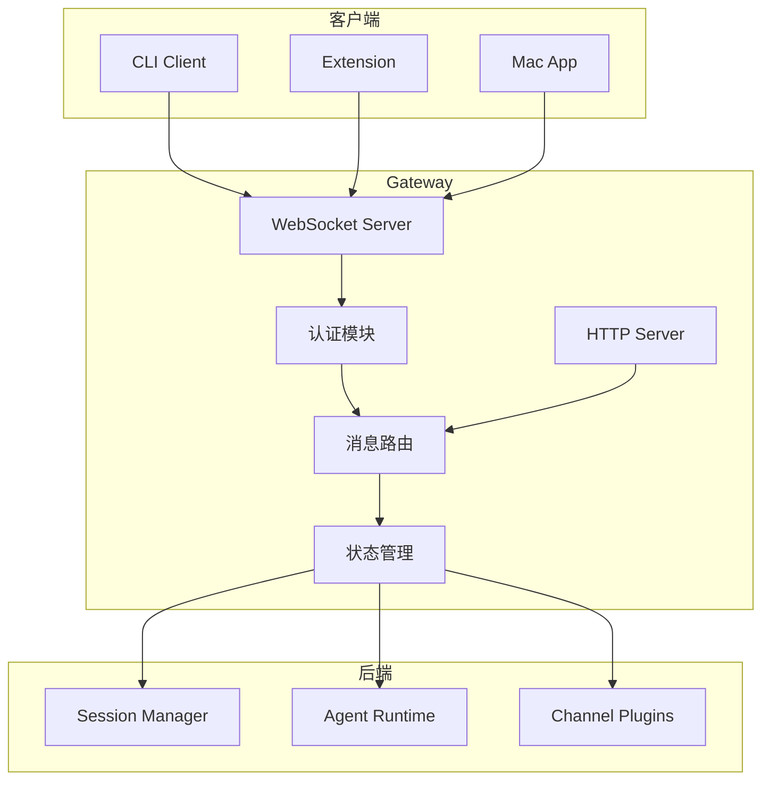
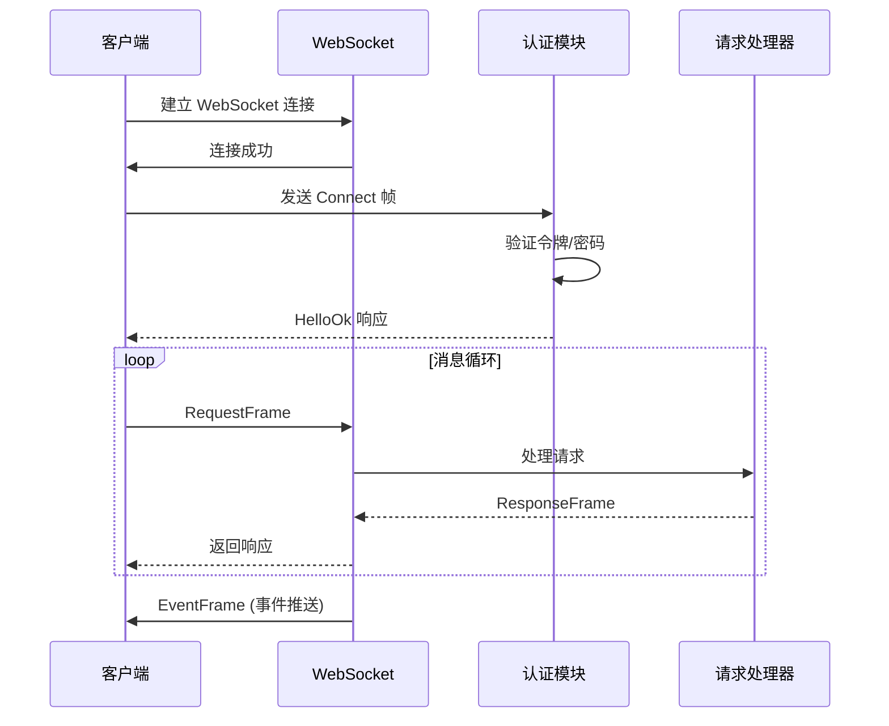
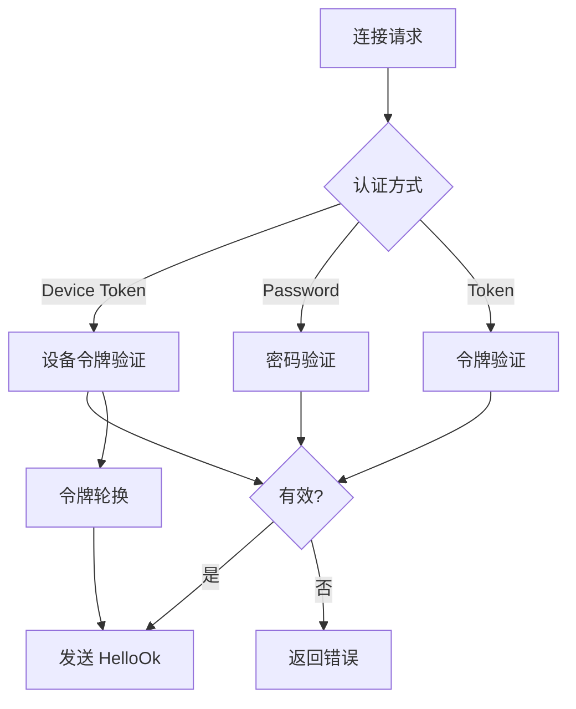
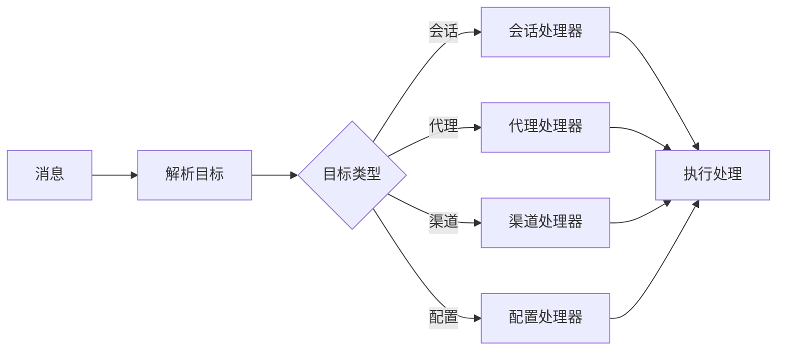
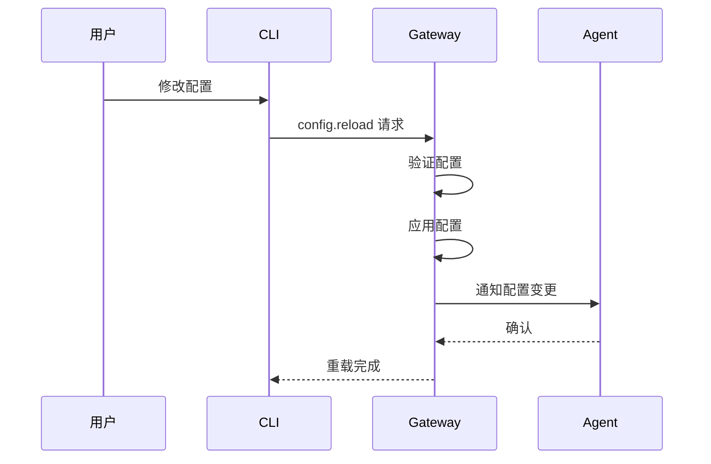

# Gateway 网关

Gateway 是 OpenClaw 的核心枢纽，负责连接管理、消息路由和会话协调。

## 架构概览



## WebSocket 服务器

### 连接流程



### 协议帧结构

```typescript
// 请求帧
interface RequestFrame {
  seq: number;        // 序列号
  method: string;     // 方法名
  params: unknown;    // 参数
}

// 响应帧
interface ResponseFrame {
  seq: number;        // 对应请求序列号
  result?: unknown;   // 成功结果
  error?: ErrorShape; // 错误信息
}

// 事件帧
interface EventFrame {
  seq?: number;       // 可选序列号
  event: string;      // 事件名
  data: unknown;      // 事件数据
}
```

### 连接参数

```typescript
interface ConnectParams {
  // 认证方式
  token?: string;        // 会话令牌
  deviceToken?: string;  // 设备令牌
  password?: string;     // 密码

  // 客户端信息
  clientName: string;    // 客户端名称
  clientVersion?: string;
  platform?: string;
  deviceFamily?: string;

  // 能力声明
  mode: GatewayClientMode;  // control | agent | channel
  scopes: string[];         // 权限范围
  caps: string[];           // 能力列表
}
```

## 认证系统

### 认证方式



### 设备认证

设备令牌认证流程：

1. **首次连接**: 生成设备密钥对
2. **签名请求**: 使用私钥签名连接参数
3. **服务器验证**: 验证签名和令牌有效性
4. **令牌轮换**: 定期更新令牌

```typescript
// 设备认证负载
interface DeviceAuthPayload {
  deviceId: string;
  timestamp: number;
  nonce: string;
  signature: string;
  publicKey: string;
}
```

## 消息路由

### 路由策略



### 方法列表

| 方法 | 描述 | 权限 |
|------|------|------|
| `agent.send` | 发送消息给代理 | agent |
| `agent.abort` | 中止代理运行 | agent |
| `sessions.list` | 列出会话 | control |
| `sessions.patch` | 更新会话 | control |
| `config.get` | 获取配置 | control |
| `config.set` | 设置配置 | control |
| `channels.status` | 渠道状态 | channel |
| `tools.catalog` | 工具目录 | agent |

## 状态管理

### 会话状态

```typescript
interface SessionState {
  // 标识
  sessionKey: string;
  agentId: string;

  // 运行状态
  status: 'idle' | 'running' | 'waiting';
  lastActivity: number;

  // 上下文
  messageCount: number;
  tokenUsage: TokenUsage;

  // 快照
  snapshot?: Snapshot;
}
```

### 全局快照

```typescript
interface Snapshot {
  version: StateVersion;
  sessions: Map<string, SessionState>;
  agents: Map<string, AgentState>;
  channels: Map<string, ChannelState>;
  presence: PresenceEntry[];
}
```

## HTTP 接口

### 控制面板 API

Gateway 同时提供 HTTP 接口用于管理：

```
GET  /health          # 健康检查
GET  /api/status      # 系统状态
GET  /api/sessions    # 会话列表
POST /api/config      # 配置更新
GET  /api/channels    # 渠道状态
```

### 静态资源

控制面板 UI 静态文件服务：
- `/ui/*` - 控制面板页面
- `/assets/*` - 静态资源

## 配置热重载



## 安全机制

### TLS 配置

远程连接必须使用 TLS：

```typescript
// 安全检查
if (!isSecureWebSocketUrl(url)) {
  throw new Error('SECURITY ERROR: Cannot connect over plaintext ws://');
}
```

### 速率限制

```typescript
interface RateLimitConfig {
  maxRequests: number;
  windowMs: number;
  skipFailedRequests: boolean;
}
```

### 权限控制

基于 scopes 的权限控制：

```typescript
const requiredScopes: Record<string, string[]> = {
  'agent.send': ['agent'],
  'config.set': ['control:write'],
  'channels.status': ['channel', 'control'],
};
```

## 监控和日志

### 健康检查

```bash
# 检查 Gateway 状态
openclaw channels status --probe
```

### 日志输出

```
~/.openclaw/logs/gateway.log
```

日志级别：
- `debug`: 详细调试信息
- `info`: 常规操作日志
- `warn`: 警告信息
- `error`: 错误信息