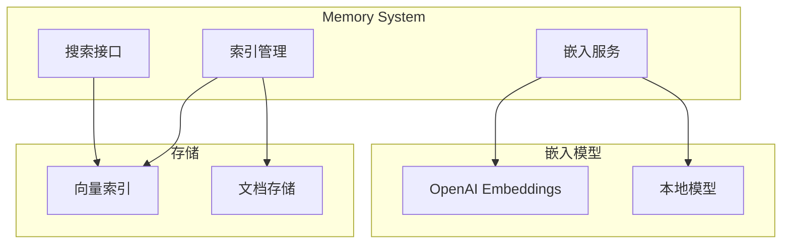
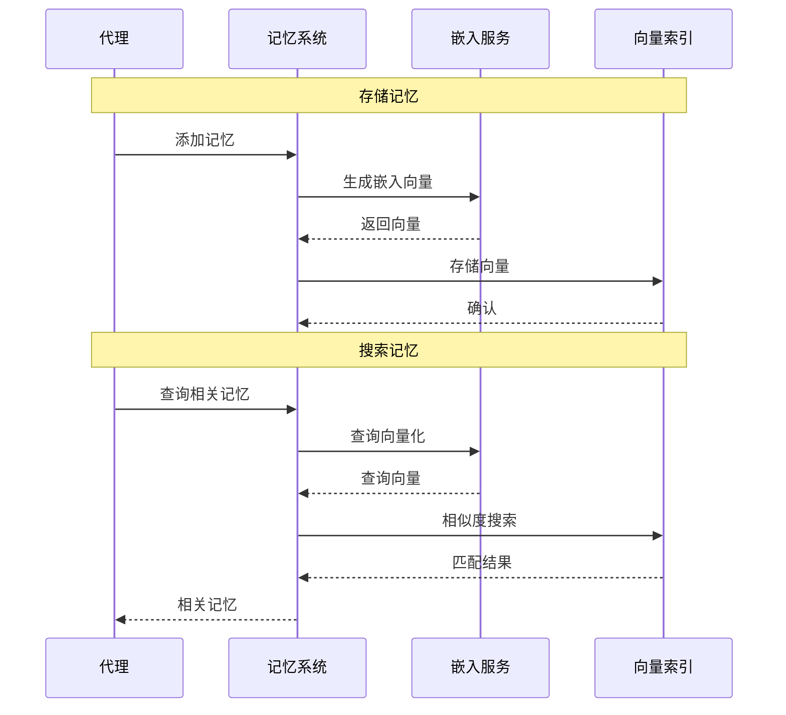
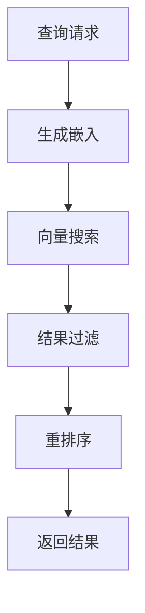
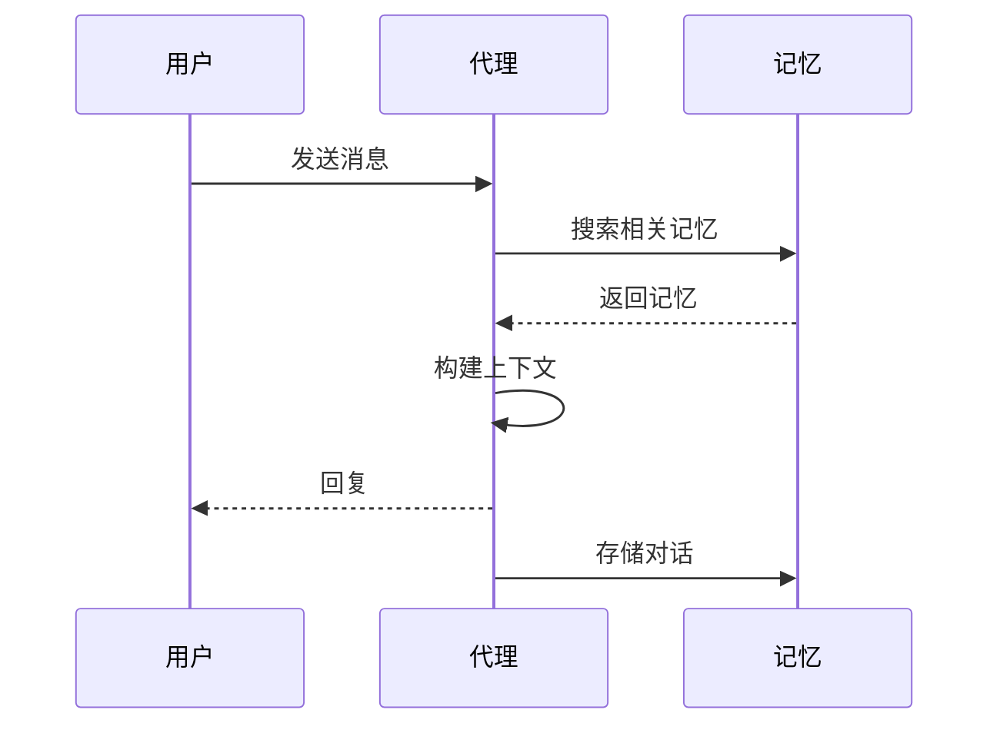

# Memory 记忆

Memory 模块提供向量搜索和长期记忆功能，支持语义检索相关对话内容。

## 概述



## 架构设计

### 核心组件

```typescript
interface MemorySystem {
  // 索引管理
  indexManager: MemoryIndexManager;

  // 搜索接口
  searchManager: MemorySearchManager;

  // 嵌入服务
  embeddingService: EmbeddingService;
}
```

### 数据流



## 索引管理

### MemoryIndexManager

```typescript
class MemoryIndexManager {
  // 创建索引
  async createIndex(params: {
    name: string;
    dimension: number;
    metric: 'cosine' | 'euclidean' | 'dot';
  }): Promise<void>;

  // 添加向量
  async addVectors(params: {
    indexName: string;
    vectors: VectorEntry[];
  }): Promise<void>;

  // 删除向量
  async deleteVectors(params: {
    indexName: string;
    ids: string[];
  }): Promise<void>;
}

interface VectorEntry {
  id: string;
  vector: number[];
  metadata?: Record<string, unknown>;
}
```

### 索引配置

```typescript
interface IndexConfig {
  name: string;
  dimension: number;
  metric: DistanceMetric;

  // 存储配置
  persist: boolean;
  path?: string;

  // 性能配置
  efConstruction?: number;
  M?: number;
}
```

## 搜索接口

### MemorySearchManager

```typescript
interface MemorySearchManager {
  // 语义搜索
  search(params: SearchParams): Promise<SearchResult[]>;

  // 混合搜索
  hybridSearch(params: HybridSearchParams): Promise<SearchResult[]>;
}

interface SearchParams {
  query: string;
  topK?: number;
  threshold?: number;
  filter?: Filter;
}

interface SearchResult {
  id: string;
  score: number;
  content: string;
  metadata?: Record<string, unknown>;
}
```

### 搜索流程



## 嵌入服务

### 支持的嵌入模型

| 提供商 | 模型 | 维度 |
|--------|------|------|
| OpenAI | text-embedding-3-small | 1536 |
| OpenAI | text-embedding-3-large | 3072 |
| Google | gemini-embedding-2-preview | 768 |
| 本地 | all-MiniLM-L6-v2 | 384 |

### 嵌入配置

```typescript
interface EmbeddingConfig {
  provider: 'openai' | 'google' | 'local';
  model: string;

  // 批处理
  batchSize?: number;

  // 缓存
  cacheEnabled?: boolean;
}
```

## 记忆类型

### 对话记忆

```typescript
interface ConversationMemory {
  type: 'conversation';
  sessionId: string;
  content: string;
  timestamp: number;
  role: 'user' | 'assistant';
}
```

### 事实记忆

```typescript
interface FactMemory {
  type: 'fact';
  content: string;
  source: string;
  confidence: number;
  tags: string[];
}
```

### 情节记忆

```typescript
interface EpisodicMemory {
  type: 'episodic';
  event: string;
  participants: string[];
  timestamp: number;
  location?: string;
}
```

## 配置

### 代理级配置

```json
{
  "agents": {
    "list": [
      {
        "id": "assistant",
        "memorySearch": {
          "enabled": true,
          "topK": 5,
          "threshold": 0.7
        }
      }
    ]
  }
}
```

### 全局配置

```json
{
  "memory": {
    "embedding": {
      "provider": "openai",
      "model": "text-embedding-3-small"
    },
    "index": {
      "persist": true,
      "path": "~/.openclaw/memory"
    }
  }
}
```

## API 接口

### 添加记忆

```typescript
await memory.add({
  content: "用户喜欢用 Python 编程",
  metadata: {
    type: "preference",
    sessionId: "telegram:123456789"
  }
});
```

### 搜索记忆

```typescript
const results = await memory.search({
  query: "用户的编程偏好是什么？",
  topK: 5,
  threshold: 0.7
});

// results: [
//   { content: "用户喜欢用 Python 编程", score: 0.89 },
//   ...
// ]
```

### 清除记忆

```typescript
// 清除特定会话的记忆
await memory.clear({
  filter: { sessionId: "telegram:123456789" }
});

// 清除所有记忆
await memory.clearAll();
```

## 最佳实践

### 记忆粒度

- **对话记忆**: 自动存储，按会话分组
- **事实记忆**: 显式提取重要信息
- **情节记忆**: 记录重要事件

### 隐私考虑

```typescript
// 敏感信息过滤
await memory.add({
  content: sanitize(message),
  metadata: {
    sensitive: false
  }
});
```

### 性能优化

- 使用批量嵌入减少 API 调用
- 启用嵌入缓存
- 定期清理过期记忆

## 与代理集成

### 自动记忆检索

代理启动时自动检索相关记忆：



### 记忆提取

代理可以显式提取和存储事实：

```typescript
// 代理工具调用
await tools.memory_store({
  content: "用户是一名软件工程师",
  type: "fact"
});
```