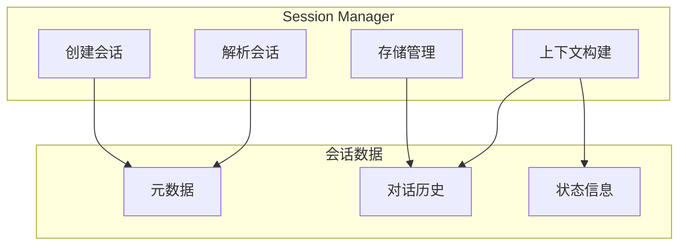
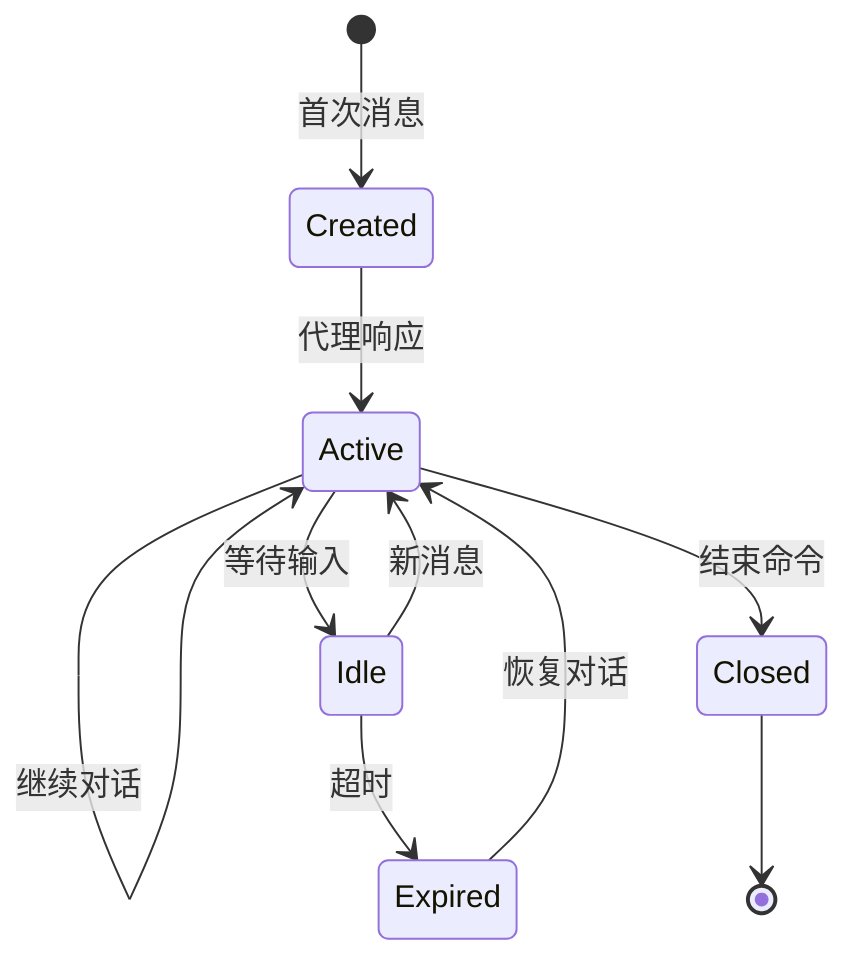
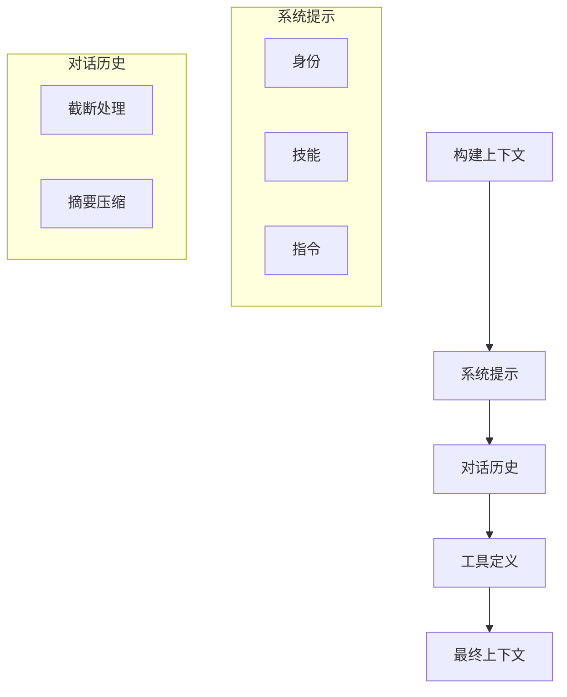
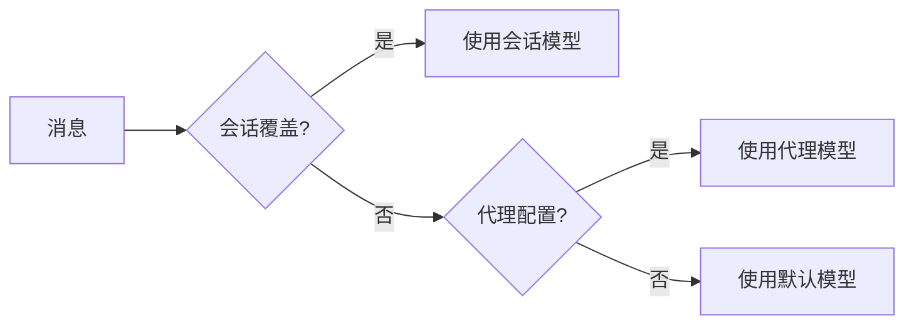

# Sessions 会话

Sessions 模块管理对话上下文、历史记录和会话状态。

## 概述



## 会话标识

### Session Key 格式

```
{channel}:{chatId}[@{agentId}]
```

示例：
- `telegram:123456789` - Telegram 私聊
- `telegram:-1001234567890@assistant` - Telegram 群组，使用 assistant 代理
- `discord:123456789012345678` - Discord 频道

### 解析逻辑

```typescript
interface ParsedSessionKey {
  channel: string;
  chatId: string;
  agentId?: string;
}

function parseSessionKey(key: string): ParsedSessionKey {
  // telegram:123456@assistant
  const [channelAndChat, agentPart] = key.split('@');
  const [channel, chatId] = channelAndChat.split(':');

  return {
    channel,
    chatId,
    agentId: agentPart || undefined
  };
}
```

## 会话生命周期



### 状态定义

```typescript
type SessionStatus =
  | 'created'    // 新创建
  | 'active'     // 活跃中
  | 'idle'       // 空闲
  | 'expired'    // 已过期
  | 'closed';    // 已关闭
```

## 会话存储

### 存储结构

```
~/.openclaw/sessions/
├── telegram:123456789/
│   ├── transcript.jsonl    # 对话历史
│   ├── context.json        # 上下文状态
│   └── metadata.json       # 元数据
└── discord:123456789/
    └── ...
```

### Transcript 格式

```jsonl
{"role":"user","content":"你好","timestamp":1709500000000}
{"role":"assistant","content":"你好！有什么可以帮助你的？","timestamp":1709500001000}
{"role":"user","content":"帮我查一下天气","timestamp":1709500010000}
{"role":"assistant","content":"好的，请问你在哪个城市？","timestamp":1709500011000}
```

### 元数据结构

```typescript
interface SessionMetadata {
  // 标识
  sessionKey: string;
  agentId: string;

  // 时间戳
  createdAt: number;
  updatedAt: number;
  lastActivityAt: number;

  // 统计
  messageCount: number;
  tokenUsage: TokenUsage;

  // 状态
  status: SessionStatus;
  modelUsed: string;
}
```

## 会话管理操作

### 创建会话

```typescript
async function createSession(params: {
  sessionKey: string;
  agentId: string;
}): Promise<Session> {
  // 1. 检查会话是否已存在
  // 2. 创建会话目录
  // 3. 初始化元数据
  // 4. 返回会话对象
}
```

### 解析会话

```typescript
async function resolveSession(params: {
  sessionKey: string;
}): Promise<Session | null> {
  // 1. 解析 session key
  // 2. 查找会话目录
  // 3. 加载元数据和历史
  // 4. 返回会话对象
}
```

### 更新会话

```typescript
interface SessionsPatchParams {
  sessionKey: string;
  updates: {
    // 可更新字段
    modelOverride?: string;
    systemPromptAppend?: string;
    clearHistory?: boolean;
  };
}
```

### 删除会话

```typescript
async function deleteSession(params: {
  sessionKey: string;
}): Promise<void> {
  // 1. 停止相关代理运行
  // 2. 删除会话目录
  // 3. 清理缓存
}
```

## 上下文管理

### 上下文窗口

```typescript
interface ContextWindow {
  // 消息列表
  messages: Message[];

  // Token 统计
  tokenCount: number;
  maxTokens: number;

  // 截断策略
  truncationStrategy: 'sliding' | 'summary';
}
```

### 上下文构建



### Token 管理

```typescript
interface TokenUsage {
  input: number;
  output: number;
  total: number;
}

// Token 限制
const MODEL_LIMITS: Record<string, number> = {
  'claude-sonnet-4-20250514': 200000,
  'gpt-4o': 128000,
  'gemini-2.0-flash': 1000000,
};
```

## 模型覆盖

### 会话级模型配置

```typescript
interface ModelOverride {
  primary?: string;
  fallbacks?: string[];
}
```

### 覆盖优先级



## 会话 API

### Gateway 方法

| 方法 | 描述 |
|------|------|
| `sessions.list` | 列出所有会话 |
| `sessions.resolve` | 解析指定会话 |
| `sessions.patch` | 更新会话配置 |
| `sessions.reset` | 重置会话历史 |
| `sessions.delete` | 删除会话 |
| `sessions.compact` | 压缩会话存储 |
| `sessions.usage` | 获取 Token 使用量 |

### CLI 命令

```bash
# 列出会话
openclaw sessions list

# 查看会话详情
openclaw sessions show telegram:123456789

# 删除会话
openclaw sessions delete telegram:123456789

# 重置会话历史
openclaw sessions reset telegram:123456789
```

## 会话事件

### 事件类型

```typescript
type SessionEvent =
  | { type: 'created'; sessionKey: string }
  | { type: 'updated'; sessionKey: string }
  | { type: 'deleted'; sessionKey: string }
  | { type: 'expired'; sessionKey: string };
```

### 事件订阅

```typescript
// 订阅会话事件
gateway.subscribe('session', (event: SessionEvent) => {
  console.log(`Session ${event.type}: ${event.sessionKey}`);
});
```

## 最佳实践

### 会话清理

```bash
# 清理过期会话
openclaw sessions compact --older-than 30d
```

### 备份恢复

```bash
# 备份会话
cp -r ~/.openclaw/sessions ./sessions-backup

# 恢复会话
cp -r ./sessions-backup/* ~/.openclaw/sessions/
```