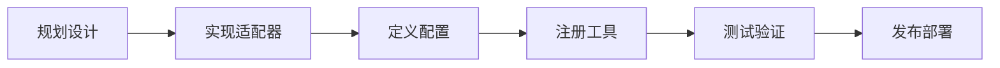

# Channel 开发

本指南介绍如何开发自定义消息渠道插件。

## 开发流程



## 渠道插件结构

### 基本结构

```typescript
import type {
  ChannelPlugin,
  ChannelId,
  ChannelMeta,
  ChannelMessagingAdapter,
  ChannelStatusAdapter
} from 'openclaw/plugin-sdk';

const MyChannelPlugin: ChannelPlugin = {
  id: 'my-channel' as ChannelId,

  meta: {
    displayName: 'My Channel',
    description: 'Description of my channel',
    order: 100,
    features: {
      groups: true,
      mentions: true,
      streaming: false
    }
  },

  // 实现所需适配器
  messaging: { /* ... */ },
  status: { /* ... */ }
};

export default MyChannelPlugin;
```

## 实现消息适配器

### 消息轮询

```typescript
const messagingAdapter: ChannelMessagingAdapter = {
  poll: async (ctx: ChannelPollContext): Promise<ChannelPollResult> => {
    // 1. 调用渠道 API 获取消息
    const response = await fetch('https://api.mychannel.com/messages', {
      headers: { 'Authorization': `Bearer ${ctx.config.token}` }
    });

    const data = await response.json();

    // 2. 转换为标准格式
    const messages = data.messages.map(msg => ({
      id: msg.id,
      timestamp: msg.timestamp,
      chatId: msg.chat_id,
      senderId: msg.sender_id,
      text: msg.text,
      isGroup: msg.is_group
    }));

    // 3. 确认已接收
    await fetch('https://api.mychannel.com/messages/ack', {
      method: 'POST',
      body: JSON.stringify({ ids: messages.map(m => m.id) })
    });

    return { messages };
  }
};
```

### 发送消息

```typescript
const messagingAdapter: ChannelMessagingAdapter = {
  send: async (ctx: ChannelOutboundContext): Promise<void> => {
    const { chatId, text, config } = ctx;

    await fetch('https://api.mychannel.com/send', {
      method: 'POST',
      headers: {
        'Authorization': `Bearer ${config.token}`,
        'Content-Type': 'application/json'
      },
      body: JSON.stringify({
        chat_id: chatId,
        text: text
      })
    });
  }
};
```

### 流式发送

```typescript
const outboundAdapter: ChannelOutboundAdapter = {
  stream: async function* (ctx: ChannelOutboundContext) {
    const { chatId, text, config } = ctx;

    // 分批发送
    const chunks = text.match(/.{1,100}/g) || [];

    for (const chunk of chunks) {
      const response = await fetch('https://api.mychannel.com/send', {
        method: 'POST',
        headers: { 'Authorization': `Bearer ${config.token}` },
        body: JSON.stringify({ chat_id: chatId, text: chunk })
      });

      const data = await response.json();

      yield {
        id: data.message_id,
        done: false
      };
    }

    yield { done: true };
  }
};
```

## 实现状态适配器

### 获取状态

```typescript
const statusAdapter: ChannelStatusAdapter = {
  status: async (): Promise<ChannelAccountSnapshot> => {
    const response = await fetch('https://api.mychannel.com/me');
    const data = await response.json();

    return {
      connected: true,
      username: data.username,
      displayName: data.display_name,
      avatarUrl: data.avatar_url
    };
  },

  probe: async (): Promise<BaseProbeResult> => {
    try {
      await fetch('https://api.mychannel.com/health');
      return { ok: true };
    } catch (error) {
      return {
        ok: false,
        error: 'Connection failed'
      };
    }
  }
};
```

## 实现安全适配器

### 权限策略

```typescript
const securityAdapter: ChannelSecurityAdapter = {
  dmPolicy: async (ctx: ChannelSecurityContext): Promise<SecurityDecision> => {
    const { senderId, config } = ctx;

    // 检查白名单
    const allowFrom = config.allowFrom || [];

    if (allowFrom.length === 0 || allowFrom.includes(senderId)) {
      return { allow: true };
    }

    return {
      allow: false,
      reason: 'User not in allowlist'
    };
  },

  groupPolicy: async (ctx: ChannelSecurityContext): Promise<SecurityDecision> => {
    // 群组策略
    const { chatId, config } = ctx;
    const allowedGroups = config.allowedGroups || [];

    if (allowedGroups.length === 0 || allowedGroups.includes(chatId)) {
      return { allow: true };
    }

    return {
      allow: false,
      reason: 'Group not allowed'
    };
  }
};
```

## 实现群组适配器

### 群组管理

```typescript
const groupAdapter: ChannelGroupAdapter = {
  listGroups: async (): Promise<ChannelDirectoryEntry[]> => {
    const response = await fetch('https://api.mychannel.com/groups');
    const groups = await response.json();

    return groups.map(g => ({
      id: g.id,
      name: g.name,
      kind: 'group' as const
    }));
  },

  listMembers: async (groupId: string): Promise<ChannelDirectoryEntry[]> => {
    const response = await fetch(`https://api.mychannel.com/groups/${groupId}/members`);
    const members = await response.json();

    return members.map(m => ({
      id: m.id,
      name: m.name,
      kind: 'user' as const
    }));
  }
};
```

## 配置 Schema

### 定义配置结构

```typescript
const configSchema: ChannelConfigSchema = {
  type: 'object',
  properties: {
    token: {
      type: 'string',
      title: 'API Token',
      description: 'Your MyChannel API token'
    },
    allowFrom: {
      type: 'array',
      items: { type: 'string' },
      title: 'Allowed Users',
      description: 'User IDs allowed to interact with the bot'
    },
    allowedGroups: {
      type: 'array',
      items: { type: 'string' },
      title: 'Allowed Groups',
      description: 'Group IDs where bot is active'
    },
    commands: {
      type: 'object',
      properties: {
        enabled: {
          type: 'array',
          items: { type: 'string' },
          title: 'Enabled Commands'
        }
      }
    }
  },
  required: ['token'],
  ui: {
    order: ['token', 'allowFrom', 'allowedGroups', 'commands'],
    groups: [
      {
        title: 'Authentication',
        fields: ['token']
      },
      {
        title: 'Access Control',
        fields: ['allowFrom', 'allowedGroups']
      },
      {
        title: 'Commands',
        fields: ['commands']
      }
    ]
  }
};
```

## 完整示例

```typescript
import type {
  ChannelPlugin,
  ChannelId,
  ChannelConfigSchema
} from 'openclaw/plugin-sdk';

const configSchema: ChannelConfigSchema = {
  type: 'object',
  properties: {
    token: { type: 'string', title: 'API Token' }
  },
  required: ['token']
};

const MyChannelPlugin: ChannelPlugin = {
  id: 'my-channel' as ChannelId,

  meta: {
    displayName: 'My Channel',
    description: 'Custom channel integration',
    features: {
      groups: true,
      streaming: true
    }
  },

  setup: {
    configSchema,
    setup: async (input) => {
      // 验证 token
      const response = await fetch('https://api.mychannel.com/verify', {
        headers: { 'Authorization': `Bearer ${input.config.token}` }
      });

      if (!response.ok) {
        throw new Error('Invalid token');
      }
    }
  },

  messaging: {
    poll: async (ctx) => { /* ... */ },
    send: async (ctx) => { /* ... */ }
  },

  status: {
    status: async () => { /* ... */ },
    probe: async () => { /* ... */ }
  },

  security: {
    dmPolicy: async (ctx) => { /* ... */ },
    groupPolicy: async (ctx) => { /* ... */ }
  },

  group: {
    listGroups: async () => { /* ... */ },
    listMembers: async (id) => { /* ... */ }
  }
};

export default MyChannelPlugin;
```

## 测试策略

### Mock 测试

```typescript
import { describe, it, expect, vi } from 'vitest';

describe('MyChannelPlugin', () => {
  it('should poll messages correctly', async () => {
    // Mock fetch
    global.fetch = vi.fn().mockResolvedValue({
      json: () => Promise.resolve({
        messages: [
          { id: '1', text: 'Hello', chat_id: 'chat1' }
        ]
      })
    });

    const result = await MyChannelPlugin.messaging!.poll!({
      config: { token: 'test' }
    });

    expect(result.messages).toHaveLength(1);
    expect(result.messages[0].text).toBe('Hello');
  });
});
```

### 集成测试

```typescript
describe('MyChannelPlugin integration', () => {
  it('should handle full message flow', async () => {
    // 1. 发送测试消息
    await MyChannelPlugin.messaging!.send!({
      chatId: 'test-chat',
      text: 'Test message',
      config: { token: process.env.TEST_TOKEN }
    });

    // 2. 轮询消息
    const result = await MyChannelPlugin.messaging!.poll!({
      config: { token: process.env.TEST_TOKEN }
    });

    // 3. 验证
    expect(result.messages.some(m => m.text === 'Test message')).toBe(true);
  });
});
```

## 发布和分发

### npm 发布

```json
{
  "name": "@openclaw/plugin-mychannel",
  "version": "1.0.0",
  "main": "dist/index.js",
  "types": "dist/index.d.ts",
  "files": ["dist"],
  "keywords": ["openclaw", "plugin", "channel"],
  "peerDependencies": {
    "openclaw": ">=1.0.0"
  }
}
```

### 文档

提供完整的文档：
- 安装说明
- 配置指南
- API 参考
- 故障排除