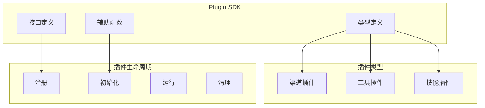

# Plugin SDK

Plugin SDK 提供开发 OpenClaw 插件的接口和工具。

## 概述



## 核心类型

### Channel Types

```typescript
// 渠道标识
type ChannelId = string;

// 渠道插件
interface ChannelPlugin {
  id: ChannelId;
  meta: ChannelMeta;

  // 适配器
  setup?: ChannelSetupAdapter;
  messaging?: ChannelMessagingAdapter;
  status?: ChannelStatusAdapter;
  group?: ChannelGroupAdapter;
  outbound?: ChannelOutboundAdapter;
  pairing?: ChannelPairingAdapter;
  security?: ChannelSecurityAdapter;
}

// 渠道元数据
interface ChannelMeta {
  displayName: string;
  order?: number;
  icon?: string;
  description?: string;
  features?: ChannelFeatures;
}
```

### Tool Types

```typescript
// 工具定义
interface ChannelAgentTool {
  name: string;
  description: string;
  parameters: ToolParameters;
  execute?: (params: unknown) => Promise<unknown>;
}

// 工具参数
interface ToolParameters {
  type: 'object';
  properties: Record<string, PropertySchema>;
  required?: string[];
}

interface PropertySchema {
  type: 'string' | 'number' | 'boolean' | 'object' | 'array';
  description?: string;
  enum?: string[];
  default?: unknown;
}
```

### Config Types

```typescript
// 配置 Schema
interface ChannelConfigSchema {
  type: 'object';
  properties: Record<string, SchemaProperty>;
  required?: string[];
}

interface SchemaProperty {
  type: string;
  title?: string;
  description?: string;
  default?: unknown;
  enum?: unknown[];
  // ... JSON Schema 属性
}
```

## 适配器接口

### Setup Adapter

渠道初始化：

```typescript
interface ChannelSetupAdapter {
  configSchema?: ChannelConfigSchema;
  setup?(input: ChannelSetupInput): Promise<void>;
  validate?(config: unknown): Promise<boolean>;
}
```

### Messaging Adapter

消息收发：

```typescript
interface ChannelMessagingAdapter {
  // 轮询消息
  poll?(ctx: ChannelPollContext): Promise<ChannelPollResult>;

  // 发送消息
  send?(ctx: ChannelOutboundContext): Promise<void>;

  // 编辑消息
  edit?(ctx: ChannelOutboundContext): Promise<void>;

  // 删除消息
  delete?(ids: string[]): Promise<void>;
}
```

### Status Adapter

状态查询：

```typescript
interface ChannelStatusAdapter {
  status?(): Promise<ChannelAccountSnapshot>;
  probe?(): Promise<BaseProbeResult>;
  issues?(): Promise<ChannelStatusIssue[]>;
}
```

### Group Adapter

群组管理：

```typescript
interface ChannelGroupAdapter {
  listGroups?(): Promise<ChannelDirectoryEntry[]>;
  listMembers?(groupId: string): Promise<ChannelDirectoryEntry[]>;
  addMember?(groupId: string, userId: string): Promise<void>;
  removeMember?(groupId: string, userId: string): Promise<void>;
}
```

### Outbound Adapter

出站消息：

```typescript
interface ChannelOutboundAdapter {
  send?(ctx: ChannelOutboundContext): Promise<SendResult>;
  stream?(ctx: ChannelOutboundContext): AsyncGenerator<StreamChunk>;
  reply?(ctx: ChannelOutboundContext, replyTo: string): Promise<void>;
}
```

### Security Adapter

安全策略：

```typescript
interface ChannelSecurityAdapter {
  dmPolicy?(ctx: ChannelSecurityContext): Promise<SecurityDecision>;
  groupPolicy?(ctx: ChannelSecurityContext): Promise<SecurityDecision>;
}
```

## 辅助函数

### Account Helpers

```typescript
// 创建账户列表辅助函数
export function createAccountListHelpers(config: {
  listAccounts: () => Promise<Account[]>;
}): AccountListHelpers;
```

### Directory Helpers

```typescript
// 从配置列出目录
export function listDirectoryFromConfig(config: {
  groups?: string[];
  peers?: string[];
}): ChannelDirectoryEntry[];
```

### Match Helpers

```typescript
// 解析 Allowlist 匹配
export function resolveAllowlistMatch(params: {
  config: AllowlistConfig;
  sender: string;
  chatId: string;
}): AllowlistMatch | null;
```

## 开发渠道插件

### 1. 创建插件项目

```bash
mkdir my-channel-plugin
cd my-channel-plugin
npm init -y
npm install openclaw
```

### 2. 定义插件

```typescript
// src/index.ts
import type { ChannelPlugin, ChannelId } from 'openclaw/plugin-sdk';

export const MyChannelPlugin: ChannelPlugin = {
  id: 'my-channel' as ChannelId,
  meta: {
    displayName: 'My Channel',
    description: 'My custom channel plugin'
  },

  // 实现适配器
  messaging: {
    poll: async (ctx) => {
      // 轮询消息逻辑
      return { messages: [] };
    },
    send: async (ctx) => {
      // 发送消息逻辑
    }
  }
};

export default MyChannelPlugin;
```

### 3. 注册插件

```typescript
// 在 OpenClaw 中注册
import { MyChannelPlugin } from 'my-channel-plugin';

// 插件会自动加载
```

## 配置 Schema

### 定义配置

```typescript
const configSchema: ChannelConfigSchema = {
  type: 'object',
  properties: {
    token: {
      type: 'string',
      title: 'API Token',
      description: 'Your API token'
    },
    allowFrom: {
      type: 'array',
      items: { type: 'string' },
      title: 'Allowed Users',
      description: 'List of allowed user IDs'
    }
  },
  required: ['token']
};
```

### UI 提示

```typescript
const configSchema: ChannelConfigSchema = {
  type: 'object',
  properties: { /* ... */ },
  ui: {
    order: ['token', 'allowFrom'],
    groups: [
      {
        title: 'Authentication',
        fields: ['token']
      },
      {
        title: 'Access Control',
        fields: ['allowFrom']
      }
    ]
  }
};
```

## 工具注册

### 定义工具

```typescript
const myTool: ChannelAgentTool = {
  name: 'my_channel_action',
  description: 'Perform an action on My Channel',
  parameters: {
    type: 'object',
    properties: {
      action: {
        type: 'string',
        description: 'Action to perform',
        enum: ['send', 'delete', 'edit']
      },
      target: {
        type: 'string',
        description: 'Target identifier'
      }
    },
    required: ['action', 'target']
  }
};
```

### 添加到插件

```typescript
const MyChannelPlugin: ChannelPlugin = {
  id: 'my-channel',
  meta: { /* ... */ },
  tools: [myTool]
};
```

## 测试

### 单元测试

```typescript
import { describe, it, expect } from 'vitest';
import { MyChannelPlugin } from './index';

describe('MyChannelPlugin', () => {
  it('should have correct id', () => {
    expect(MyChannelPlugin.id).toBe('my-channel');
  });

  it('should poll messages', async () => {
    const result = await MyChannelPlugin.messaging?.poll({});
    expect(result.messages).toBeDefined();
  });
});
```

### 集成测试

```typescript
import { createTestGateway } from 'openclaw/test-utils';

describe('MyChannelPlugin integration', () => {
  it('should work with gateway', async () => {
    const gateway = await createTestGateway();
    gateway.registerChannel(MyChannelPlugin);

    // 测试集成
  });
});
```

## 发布

### 构建插件

```bash
npm run build
```

### 发布到 npm

```bash
npm publish --access public
```

### 插件清单

```json
{
  "name": "my-channel-plugin",
  "version": "1.0.0",
  "main": "dist/index.js",
  "types": "dist/index.d.ts",
  "peerDependencies": {
    "openclaw": ">=1.0.0"
  }
}
```