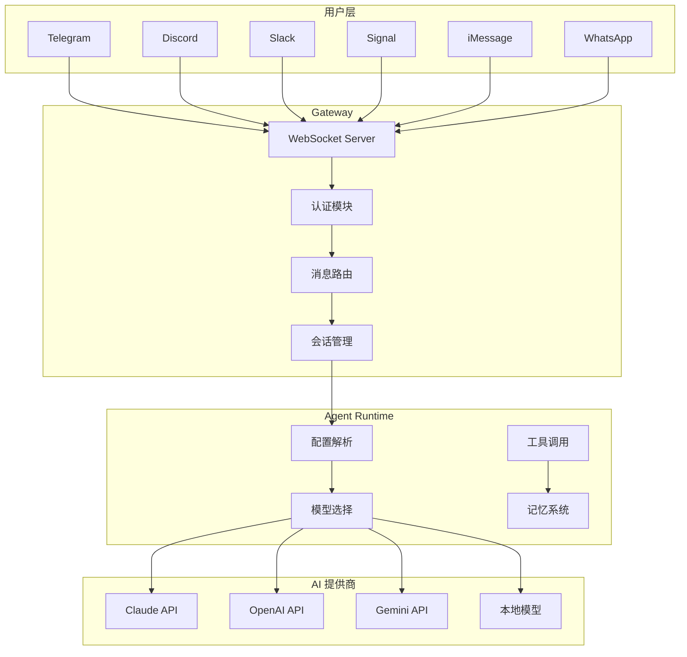
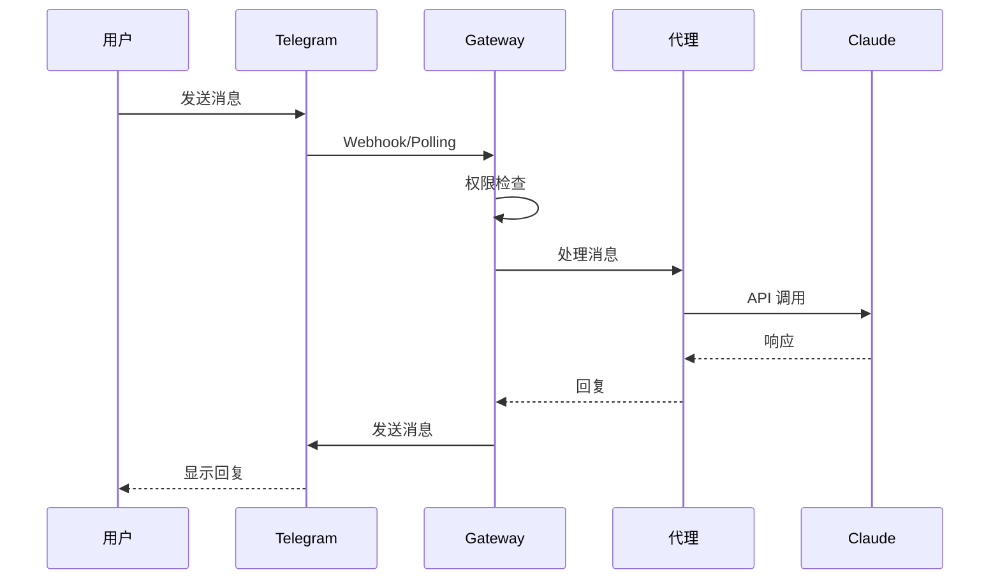
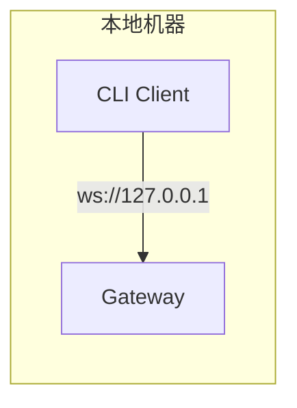
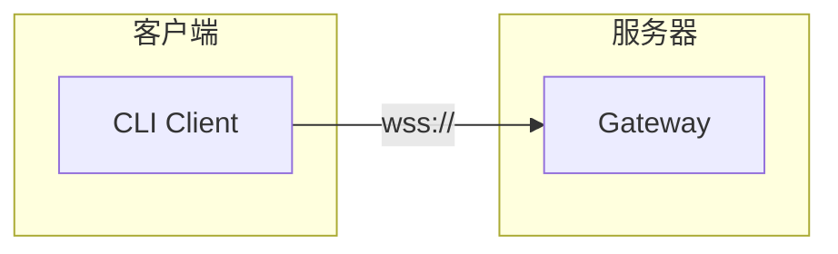

# 系统架构

OpenClaw 是一个模块化的 AI 代理网关平台，采用微内核架构设计，支持多种消息渠道和 AI 模型。

## 整体架构



## 核心组件

### Gateway (网关)

Gateway 是整个系统的核心枢纽，负责：
- WebSocket 连接管理
- 客户端认证和授权
- 消息路由和分发
- 会话状态维护
- 配置热重载

详见 [Gateway 网关](core/gateway.md)

### Agents (代理运行时)

Agents 模块管理 AI 代理的生命周期：
- 模型选择和回退策略
- 认证配置管理（API Key、OAuth）
- 工具调用执行
- Skills 技能加载
- 子代理调度

详见 [Agents 代理](core/agents.md)

### Channels (消息渠道)

Channels 通过适配器模式统一不同消息平台：
- 消息收发接口
- 状态查询接口
- 群组管理接口
- 安全策略接口

详见 [Channels 渠道](core/channels.md)

### Sessions (会话管理)

Sessions 维护对话上下文：
- 会话 ID 生成
- 对话历史存储
- 上下文窗口管理
- 模型覆盖配置

详见 [Sessions 会话](core/sessions.md)

## 设计原则

### 1. 模块化

每个核心模块独立运作，通过定义良好的接口通信：
- Gateway 处理连接和路由
- Agents 处理 AI 交互
- Channels 处理平台适配

### 2. 可扩展性

通过插件机制支持扩展：
- 新渠道通过 Channel Plugin 接入
- 新能力通过 Skills 添加
- 新工具通过 Tool 接口注册

### 3. 安全性

多层安全防护：
- TLS 加密通信
- 设备令牌认证
- 白名单权限控制
- 敏感操作审批

### 4. 可靠性

完善的错误处理：
- 模型自动回退
- 连接自动重连
- 状态持久化
- 日志追踪

## 技术栈

| 组件 | 技术 |
|------|------|
| 运行时 | Node.js 22+ / Bun |
| 语言 | TypeScript |
| 协议 | WebSocket + JSON-RPC |
| 存储 | 文件系统 (JSONL) |
| 向量搜索 | 内存索引 |

## 快速配置示例

### 最小化配置

以下是一个最小化的配置示例，适用于个人使用：

```json
{
  "model": {
    "primary": "claude-sonnet-4-20250514"
  },
  "telegram": {
    "token": "YOUR_BOT_TOKEN",
    "allowFrom": ["YOUR_USER_ID"]
  }
}
```

### 多代理配置

配置多个专业代理，每个代理负责不同领域：

```json
{
  "agents": {
    "list": [
      {
        "id": "assistant",
        "name": "通用助手",
        "default": true,
        "model": "claude-sonnet-4-20250514"
      },
      {
        "id": "coder",
        "name": "编程专家",
        "model": "claude-opus-4-20250514",
        "workspace": "~/projects",
        "skills": ["code-reviewer", "test-generator"]
      },
      {
        "id": "writer",
        "name": "写作助手",
        "model": "claude-sonnet-4-20250514",
        "skills": ["doc-writer"]
      }
    ]
  }
}
```

### 高可用配置

支持模型回退和多 API Key 配置：

```json
{
  "model": {
    "primary": "claude-opus-4-20250514",
    "fallbacks": [
      "claude-sonnet-4-20250514",
      "gpt-4o",
      "gemini-2.0-flash"
    ]
  },
  "agents": {
    "list": [
      {
        "id": "assistant",
        "model": {
          "primary": "claude-opus-4-20250514",
          "fallbacks": ["gpt-4o"]
        }
      }
    ]
  }
}
```

## 典型使用场景

### 场景一：个人助手

通过 Telegram 与 AI 对话，执行日常任务：



### 场景二：团队协作机器人

在 Discord 服务器中部署，支持多用户和线程对话：

```json
{
  "discord": {
    "token": "YOUR_BOT_TOKEN",
    "applicationId": "YOUR_APP_ID",
    "allowFrom": {
      "roles": ["admin", "developer"],
      "channels": ["C12345678"]
    },
    "threadBinding": {
      "enabled": true
    }
  }
}
```

### 场景三：代码助手

结合工作空间和工具权限，作为编程助手：

```json
{
  "agents": {
    "list": [
      {
        "id": "coder",
        "workspace": "/workspace/my-project",
        "tools": {
          "enabled": ["bash", "read_file", "write_file", "edit_file"],
          "bash": {
            "allowCommands": ["git", "npm", "pnpm", "node", "bun"]
          }
        },
        "sandbox": {
          "workdir": "/workspace/my-project",
          "allowPaths": ["/workspace/my-project/**"]
        }
      }
    ]
  }
}
```

### 场景四：多模型路由

根据任务类型自动选择最优模型：

```json
{
  "agents": {
    "list": [
      {
        "id": "fast",
        "name": "快速响应",
        "model": "claude-haiku-4-20250514",
        "description": "用于简单问答和快速任务"
      },
      {
        "id": "thinker",
        "name": "深度思考",
        "model": "claude-opus-4-20250514",
        "description": "用于复杂推理和代码生成"
      }
    ]
  }
}
```

## 架构优势

### 为什么选择微内核架构？

1. **灵活扩展**：按需加载渠道插件和技能模块
2. **独立部署**：各模块可独立升级和维护
3. **故障隔离**：单个模块故障不影响整体系统
4. **易于测试**：模块边界清晰，便于单元测试

### 与其他方案对比

| 特性 | OpenClaw | LangChain | AutoGPT |
|------|----------|-----------|---------|
| 多渠道支持 | ✅ 原生 | ⚠️ 需集成 | ❌ |
| 实时对话 | ✅ | ⚠️ | ❌ |
| 工具执行 | ✅ 安全沙箱 | ⚠️ 基础 | ✅ |
| 权限控制 | ✅ 细粒度 | ❌ | ❌ |
| 本地优先 | ✅ | ⚠️ | ✅ |
| 配置简单 | ✅ | ⚠️ 复杂 | ⚠️ |

## 部署模式

### 本地模式



### 远程模式



### 安全远程访问

推荐使用 SSH 隧道或 Tailscale：

```bash
# SSH 隧道
ssh -N -L 18789:127.0.0.1:18789 user@gateway-host

# Tailscale Funnel
tailscale funnel 18789
```