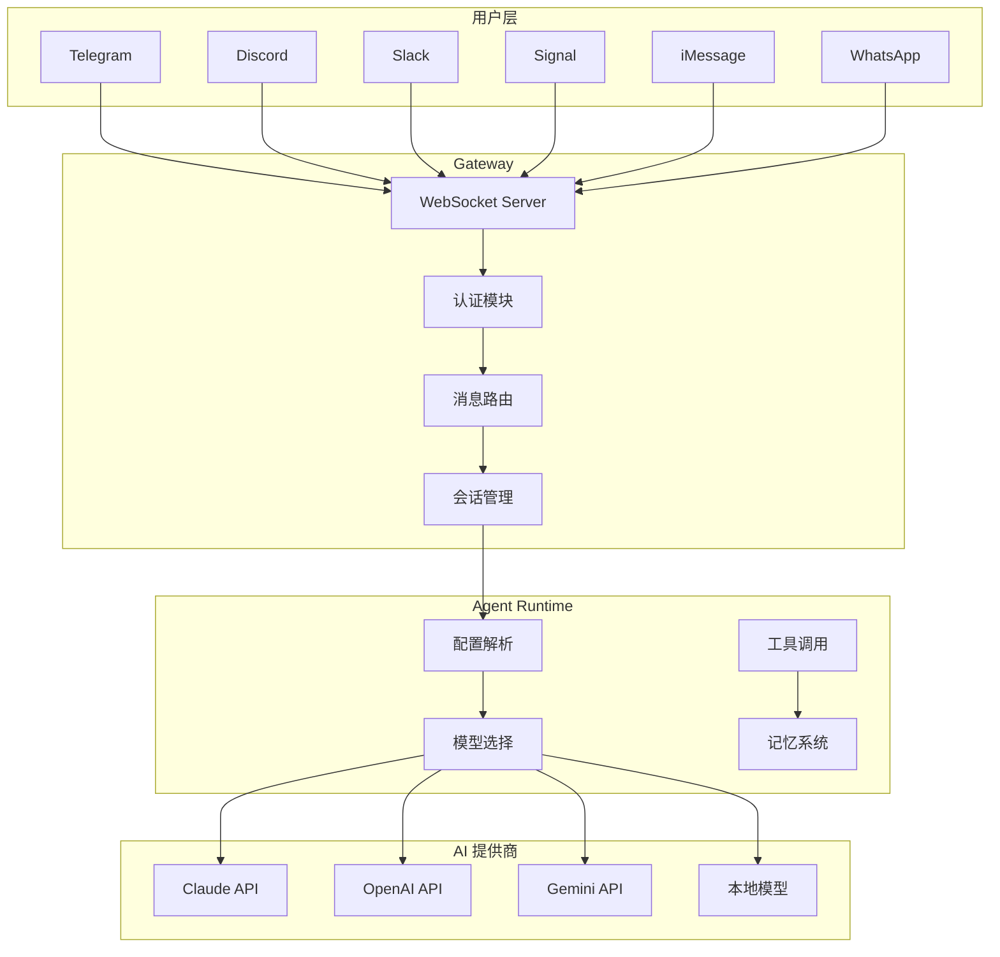
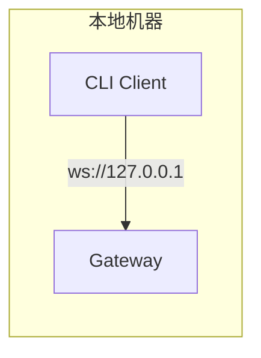
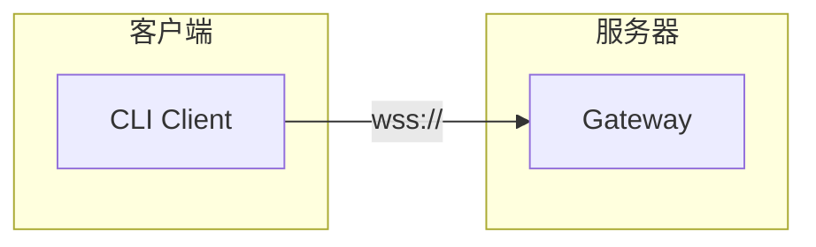

# 系统架构

OpenClaw 是一个模块化的 AI 代理网关平台，采用微内核架构设计，支持多种消息渠道和 AI 模型。

## 整体架构



## 核心组件

### Gateway (网关)

Gateway 是整个系统的核心枢纽，负责：
- WebSocket 连接管理
- 客户端认证和授权
- 消息路由和分发
- 会话状态维护
- 配置热重载

详见 [Gateway 网关](../core/gateway.md)

### Agents (代理运行时)

Agents 模块管理 AI 代理的生命周期：
- 模型选择和回退策略
- 认证配置管理（API Key、OAuth）
- 工具调用执行
- Skills 技能加载
- 子代理调度

详见 [Agents 代理](../core/agents.md)

### Channels (消息渠道)

Channels 通过适配器模式统一不同消息平台：
- 消息收发接口
- 状态查询接口
- 群组管理接口
- 安全策略接口

详见 [Channels 渠道](../core/channels.md)

### Sessions (会话管理)

Sessions 维护对话上下文：
- 会话 ID 生成
- 对话历史存储
- 上下文窗口管理
- 模型覆盖配置

详见 [Sessions 会话](../core/sessions.md)

## 设计原则

### 1. 模块化

每个核心模块独立运作，通过定义良好的接口通信：
- Gateway 处理连接和路由
- Agents 处理 AI 交互
- Channels 处理平台适配

### 2. 可扩展性

通过插件机制支持扩展：
- 新渠道通过 Channel Plugin 接入
- 新能力通过 Skills 添加
- 新工具通过 Tool 接口注册

### 3. 安全性

多层安全防护：
- TLS 加密通信
- 设备令牌认证
- 白名单权限控制
- 敏感操作审批

### 4. 可靠性

完善的错误处理：
- 模型自动回退
- 连接自动重连
- 状态持久化
- 日志追踪

## 技术栈

| 组件 | 技术 |
|------|------|
| 运行时 | Node.js 22+ / Bun |
| 语言 | TypeScript |
| 协议 | WebSocket + JSON-RPC |
| 存储 | 文件系统 (JSONL) |
| 向量搜索 | 内存索引 |

## 部署模式

### 本地模式



### 远程模式



### 安全远程访问

推荐使用 SSH 隧道或 Tailscale：

```bash
# SSH 隧道
ssh -N -L 18789:127.0.0.1:18789 user@gateway-host

# Tailscale Funnel
tailscale funnel 18789
```