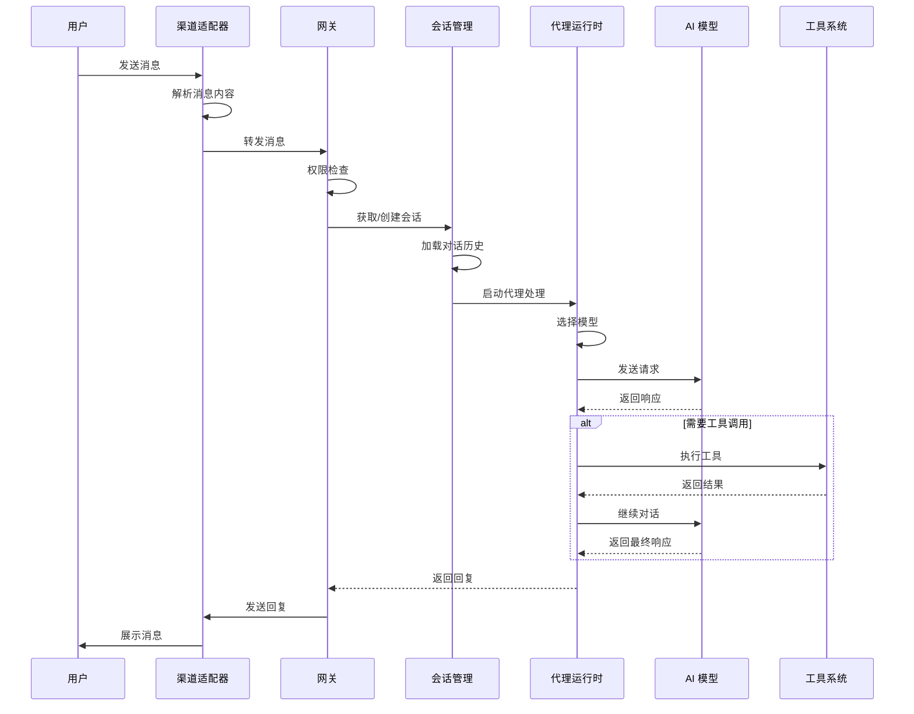
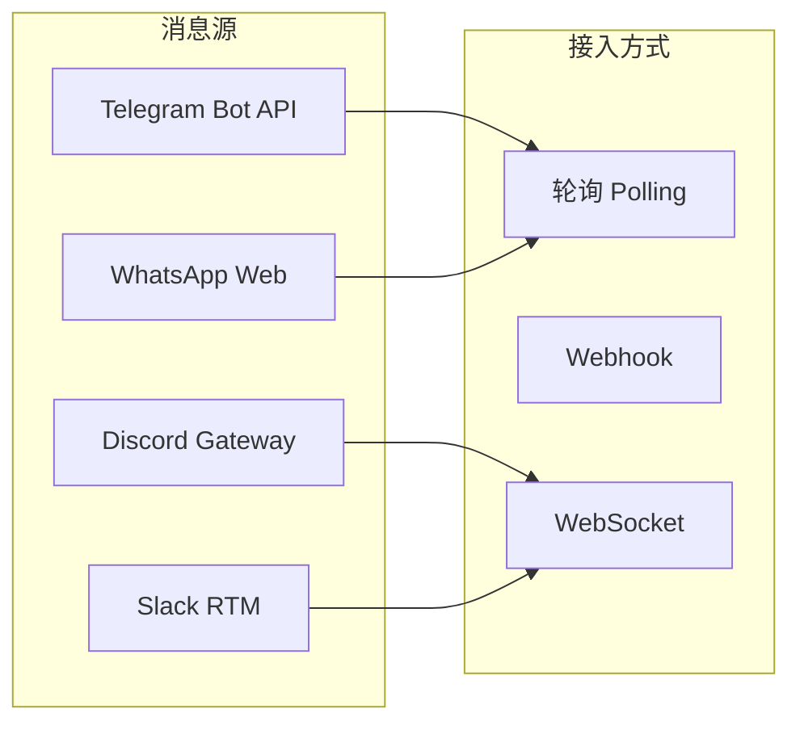
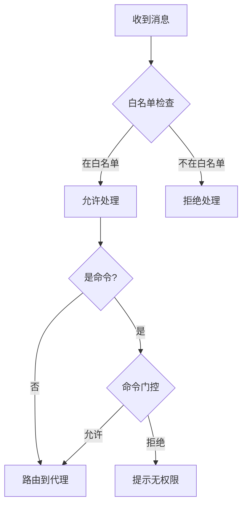
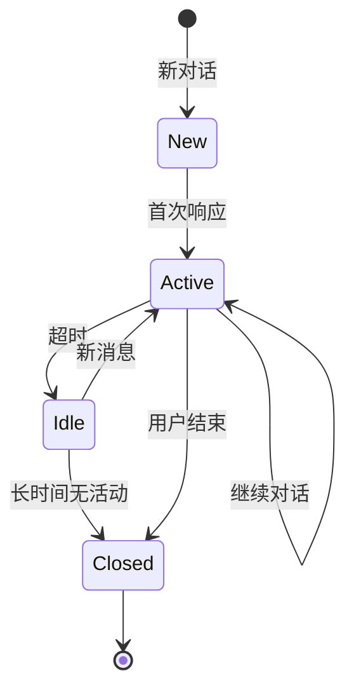
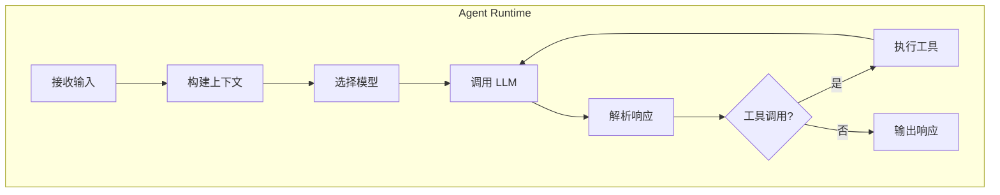
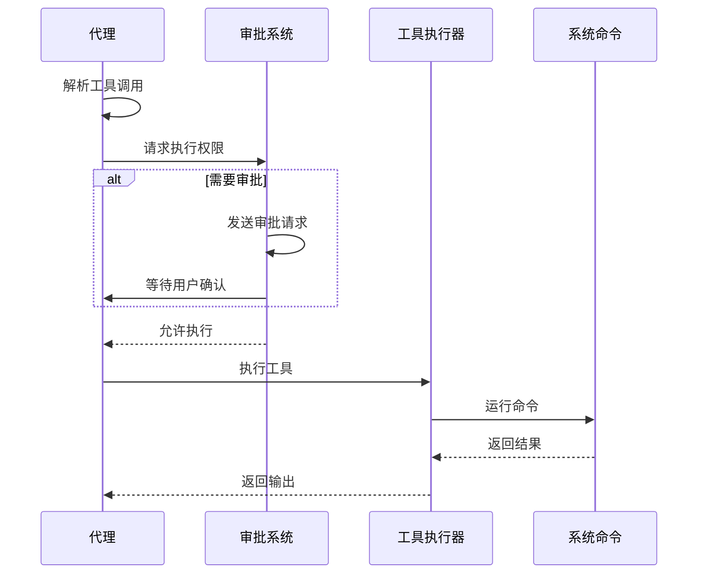

# 数据流

本文档描述消息从接收到响应的完整数据流程。

## 消息处理流程



## 详细流程说明

### 1. 消息接入



消息通过各渠道的适配器接入系统：
- **Telegram**: 通过 Bot API 长轮询
- **Discord**: 通过 Gateway WebSocket
- **Slack**: 通过 RTM WebSocket
- **Signal**: 通过 Signald WebSocket
- **iMessage**: 通过 BlueBubbles API
- **WhatsApp**: 通过 Web API 轮询

### 2. 消息解析

```typescript
interface InboundMessage {
  // 消息标识
  messageId: string;
  timestamp: number;

  // 来源信息
  channel: ChannelId;
  chatId: string;
  senderId: string;

  // 消息内容
  text?: string;
  attachments?: Attachment[];
  replyTo?: string;

  // 元数据
  isGroup: boolean;
  mentions?: string[];
}
```

### 3. 权限检查



权限检查包括：
1. **白名单验证**: 检查发送者是否在允许列表
2. **命令门控**: 检查是否有执行命令的权限
3. **群组策略**: 检查群组特定的访问规则

### 4. 会话管理



会话生命周期：
- **New**: 新创建的会话
- **Active**: 正在进行对话
- **Idle**: 等待用户输入
- **Closed**: 会话已结束

### 5. 代理处理



代理处理步骤：
1. **构建上下文**: 组装系统提示、对话历史、工具定义
2. **选择模型**: 根据配置和可用性选择 LLM
3. **调用 LLM**: 发送请求并处理流式响应
4. **解析响应**: 提取文本内容和工具调用
5. **执行工具**: 如有工具调用，执行并继续对话

### 6. 工具执行



工具执行安全机制：
- **沙箱隔离**: 在受限环境中执行
- **权限审批**: 敏感操作需要用户确认
- **命令白名单**: 限制可执行的命令
- **超时保护**: 防止长时间运行的命令

### 7. 响应发送

```typescript
interface OutboundMessage {
  // 目标信息
  channel: ChannelId;
  chatId: string;
  replyTo?: string;

  // 响应内容
  text: string;
  attachments?: Attachment[];

  // 流式控制
  streaming: boolean;
  done: boolean;
}
```

响应发送策略：
- **流式输出**: 逐字符/逐段发送
- **分片处理**: 长消息自动分片
- **重试机制**: 发送失败自动重试
- **幂等保证**: 避免重复发送

## 数据存储

### 会话数据

```
~/.openclaw/sessions/
├── {sessionKey}/
│   ├── transcript.jsonl     # 对话历史
│   ├── context.json         # 上下文状态
│   └── metadata.json        # 会话元数据
```

### 配置数据

```
~/.openclaw/
├── config.json              # 主配置文件
├── credentials/             # 凭据存储
│   ├── telegram.json
│   ├── discord.json
│   └── ...
└── agents/                  # 代理配置
    └── {agentId}/
        └── ...
```

### 日志数据

```
~/.openclaw/logs/
├── gateway.log              # 网关日志
├── agent-{id}.log           # 代理日志
└── anthropic-payload.jsonl  # API 调用日志
```