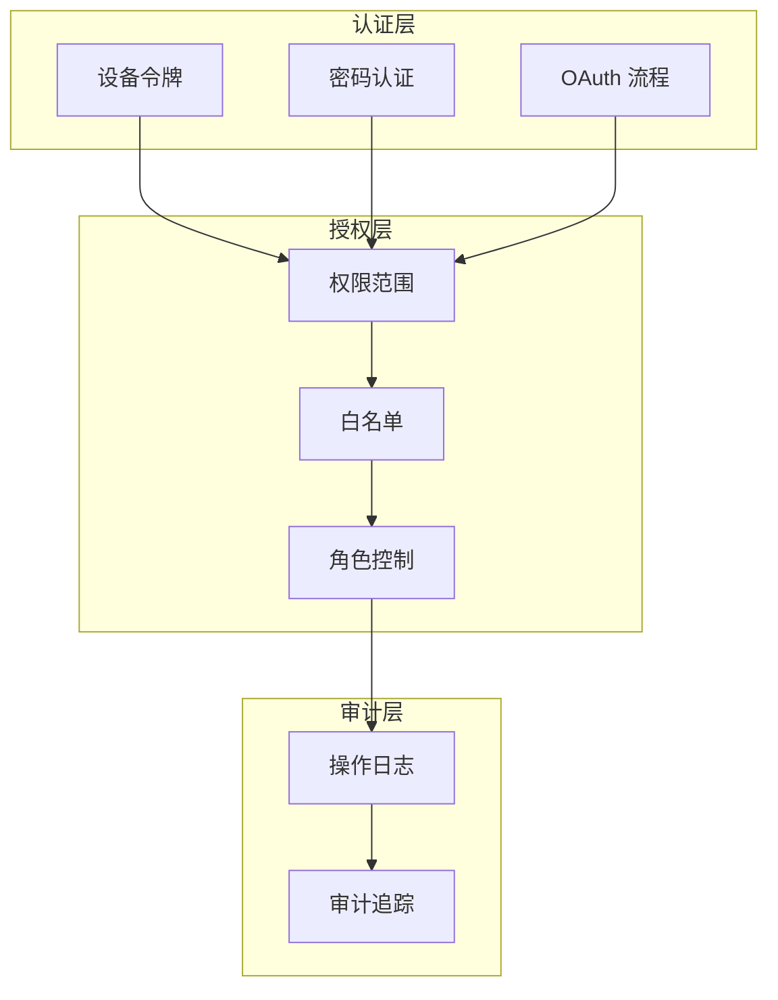
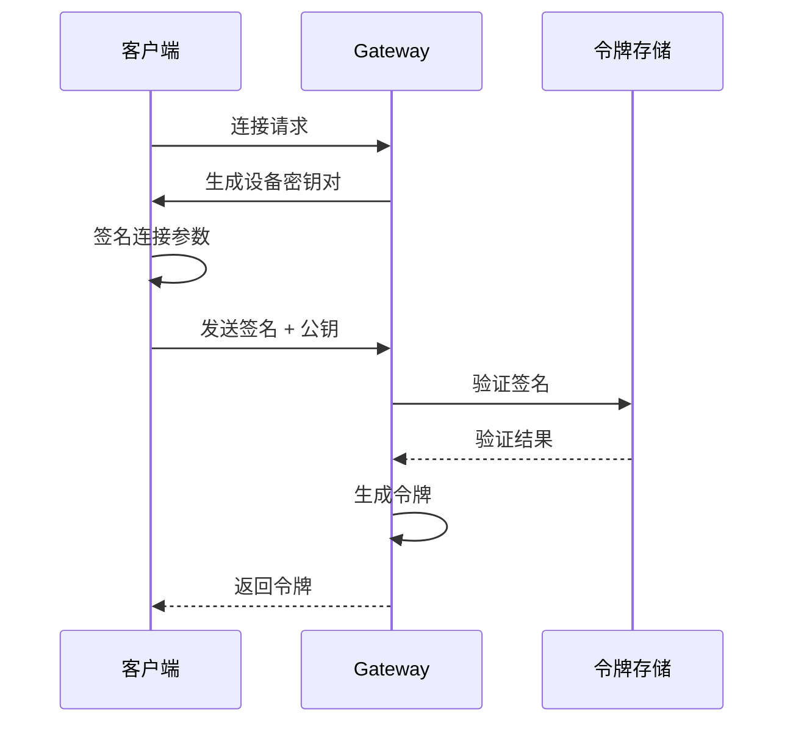
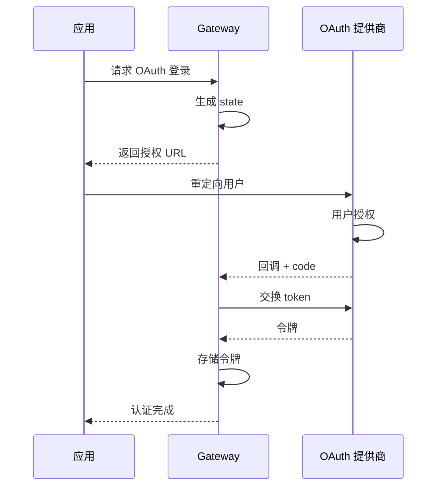
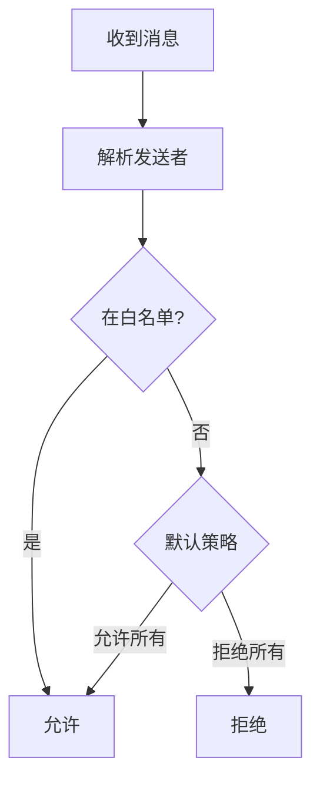

# 认证授权

OpenClaw 提供多层次的认证授权机制，保护系统安全。

## 概述



## 设备认证

### 设备令牌

设备令牌用于客户端与 Gateway 之间的认证：

```typescript
interface DeviceToken {
  // 令牌标识
  id: string;

  // 设备信息
  deviceId: string;
  deviceName?: string;

  // 密钥
  publicKey: string;

  // 有效期
  createdAt: number;
  expiresAt?: number;
}
```

### 认证流程



### 令牌轮换

设备令牌支持自动轮换：

```typescript
interface TokenRotationConfig {
  // 轮换周期
  rotationIntervalMs: number;

  // 提前轮换时间
  rotateBeforeExpiryMs: number;

  // 最大使用次数
  maxUsageCount?: number;
}
```

## 密码认证

### 密码配置

```json
{
  "gateway": {
    "password": "your-secure-password"
  }
}
```

### 密码策略

```typescript
interface PasswordPolicy {
  // 最小长度
  minLength: number;

  // 复杂度要求
  requireUppercase: boolean;
  requireLowercase: boolean;
  requireNumbers: boolean;
  requireSymbols: boolean;

  // 过期时间
  maxAgeDays?: number;
}
```

## OAuth 认证

### 支持的提供商

| 提供商 | 用途 |
|--------|------|
| OpenAI | API 认证 |
| Anthropic | API 认证 |
| Google | API 认证 |
| GitHub | 用户认证 |

### OAuth 流程



### 令牌刷新

```typescript
interface OAuthToken {
  accessToken: string;
  refreshToken: string;
  expiresAt: number;
}

// 自动刷新
async function refreshIfNeeded(token: OAuthToken): Promise<string> {
  if (Date.now() > token.expiresAt - 60000) {
    const newToken = await refreshAccessToken(token.refreshToken);
    return newToken.accessToken;
  }
  return token.accessToken;
}
```

## 权限范围

### Scope 定义

```typescript
type GatewayScope =
  | 'agent'         // 代理操作
  | 'control'       // 控制面板
  | 'control:write' // 配置写入
  | 'channel'       // 渠道操作
  | 'secrets'       // 密钥访问;
```

### Scope 映射

```typescript
const METHOD_SCOPES: Record<string, GatewayScope[]> = {
  'agent.send': ['agent'],
  'agent.abort': ['agent'],
  'config.get': ['control'],
  'config.set': ['control:write'],
  'sessions.list': ['control'],
  'channels.status': ['channel', 'control']
};
```

## 白名单系统

### Allowlist 配置

```json
{
  "security": {
    "allowFrom": {
      "telegram": ["user1", "user2"],
      "discord": ["123456789"],
      "slack": {
        "users": ["U12345"],
        "channels": ["C12345"]
      }
    }
  }
}
```

### 匹配逻辑



### 代码实现

```typescript
function checkAllowlist(
  config: AllowlistConfig,
  sender: SenderInfo
): boolean {
  const { channel, userId, chatId } = sender;

  const channelAllowlist = config[channel];
  if (!channelAllowlist) {
    return config.defaultAllow ?? false;
  }

  // 检查用户
  if (channelAllowlist.users?.includes(userId)) {
    return true;
  }

  // 检查群组
  if (channelAllowlist.groups?.includes(chatId)) {
    return true;
  }

  return false;
}
```

## 角色控制

### 角色定义

```typescript
interface Role {
  name: string;
  permissions: Permission[];
}

interface Permission {
  resource: string;
  actions: string[];
}

// 示例
const adminRole: Role = {
  name: 'admin',
  permissions: [
    { resource: 'config', actions: ['read', 'write'] },
    { resource: 'sessions', actions: ['read', 'write', 'delete'] }
  ]
};
```

### 角色分配

```json
{
  "security": {
    "roles": {
      "admin": {
        "users": ["user1"],
        "permissions": ["*"]
      },
      "user": {
        "users": ["user2", "user3"],
        "permissions": ["agent.send", "sessions.list"]
      }
    }
  }
}
```

## TLS 安全

### 远程连接要求

远程连接必须使用 TLS：

```typescript
// 安全检查
if (!isSecureWebSocketUrl(url)) {
  throw new Error(
    'SECURITY ERROR: Cannot connect over plaintext ws://. ' +
    'Use wss:// for remote connections.'
  );
}
```

### TLS 配置

```json
{
  "gateway": {
    "tls": {
      "enabled": true,
      "cert": "/path/to/cert.pem",
      "key": "/path/to/key.pem"
    }
  }
}
```

### 证书验证

```typescript
interface TLSConfig {
  // 证书路径
  cert: string;
  key: string;

  // CA 证书
  ca?: string;

  // 验证选项
  rejectUnauthorized: boolean;

  // 证书指纹验证
  fingerprint?: string;
}
```

## 凭据管理

### 存储位置

```
~/.openclaw/credentials/
├── telegram.json
├── discord.json
├── openai.json
└── ...
```

### 凭据加密

敏感凭据应加密存储：

```typescript
interface EncryptedCredential {
  encrypted: string;
  iv: string;
  tag: string;
}

// 加密
async function encryptCredential(
  plaintext: string,
  key: Buffer
): Promise<EncryptedCredential> {
  // AES-256-GCM 加密
  const iv = crypto.randomBytes(16);
  const cipher = crypto.createCipheriv('aes-256-gcm', key, iv);

  let encrypted = cipher.update(plaintext, 'utf8', 'hex');
  encrypted += cipher.final('hex');

  const tag = cipher.getAuthTag();

  return { encrypted, iv: iv.toString('hex'), tag: tag.toString('hex') };
}
```

## 审计日志

### 日志记录

```typescript
interface AuditLogEntry {
  timestamp: number;
  action: string;
  actor: string;
  resource: string;
  result: 'success' | 'failure';
  details?: unknown;
}
```

### 日志查询

```bash
# 查看认证日志
openclaw logs tail --category auth

# 查看审计日志
openclaw logs tail --category audit
```

## 最佳实践

### 凭据管理

1. 使用环境变量存储敏感信息
2. 定期轮换密钥和令牌
3. 不要在配置文件中硬编码凭据

### 访问控制

1. 遵循最小权限原则
2. 定期审查白名单
3. 启用审计日志

### 网络安全

1. 远程连接使用 TLS
2. 使用 SSH 隧道或 Tailscale
3. 避免在公网暴露 Gateway