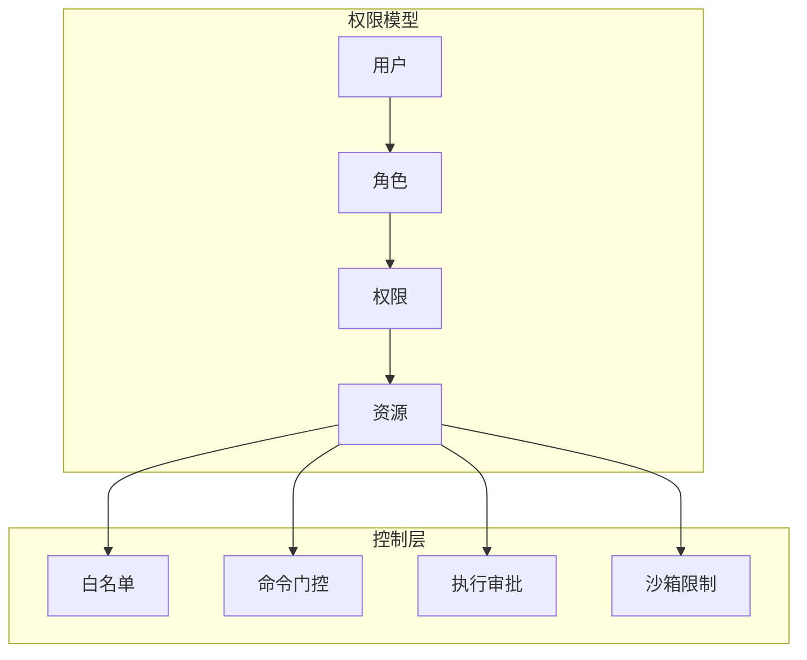
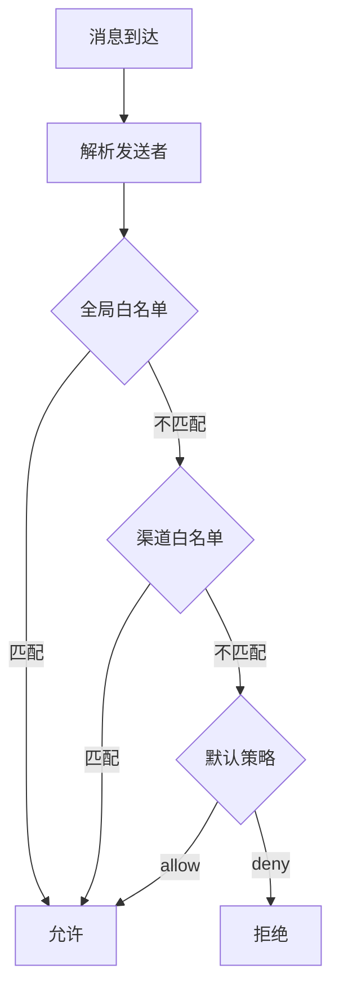
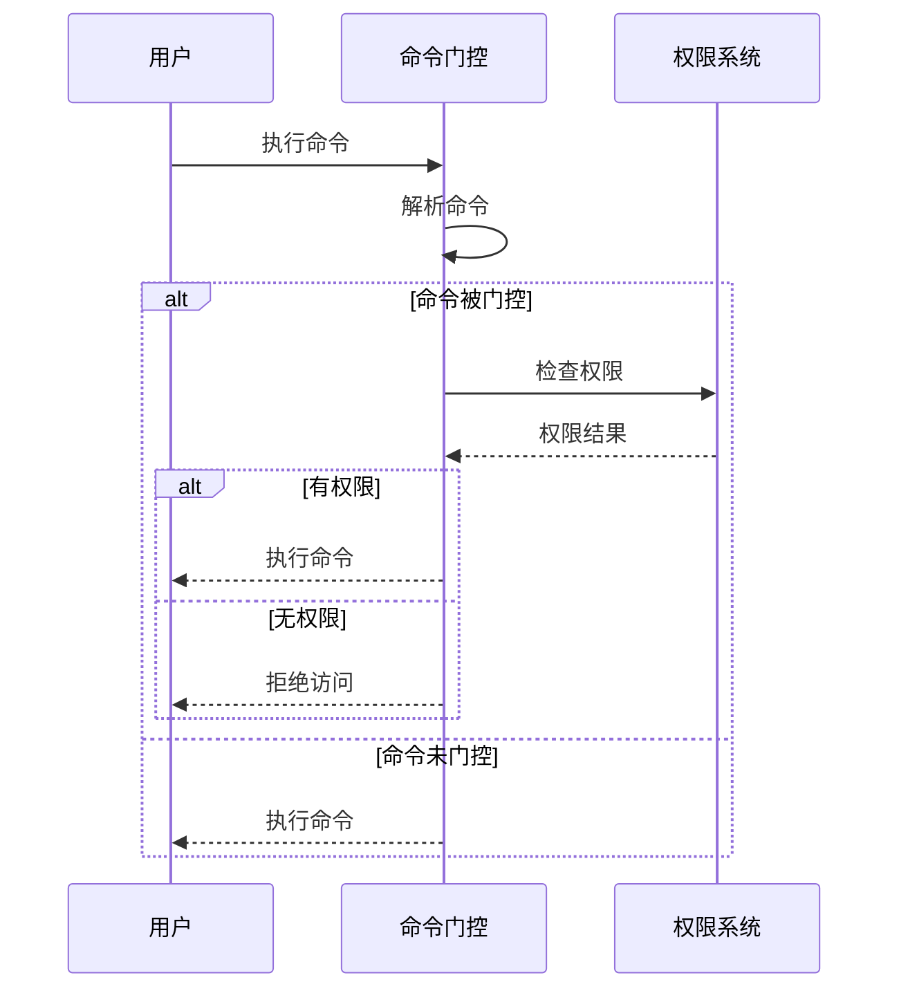
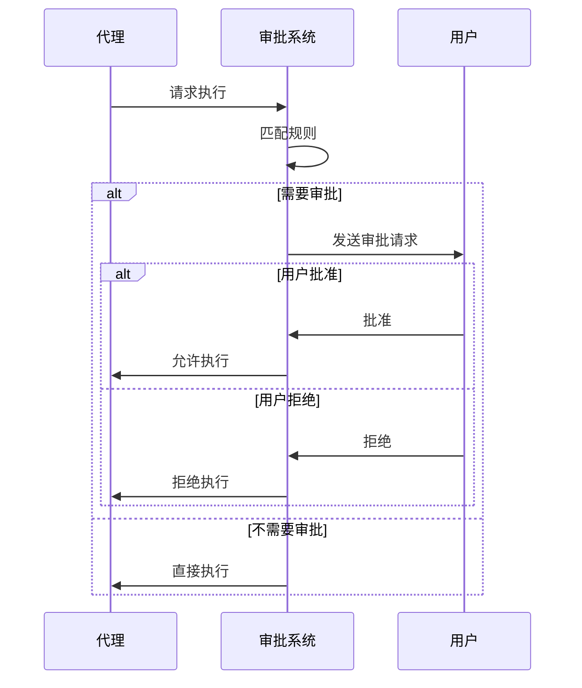

# 权限控制

OpenClaw 提供细粒度的权限控制系统，管理用户和代理的操作权限。

## 概述



## 权限模型

### 用户

```typescript
interface User {
  id: string;
  name?: string;

  // 所属角色
  roles: string[];

  // 直接权限
  permissions?: string[];
}
```

### 角色

```typescript
interface Role {
  name: string;
  description?: string;

  // 包含的权限
  permissions: string[];

  // 继承的角色
  inherits?: string[];
}
```

### 权限

```typescript
// 权限格式: resource:action
type Permission = string;

// 示例
const permissions = [
  'agent:send',       // 发送消息给代理
  'config:read',      // 读取配置
  'config:write',     // 修改配置
  'sessions:delete',  // 删除会话
  'tools:bash',       // 使用 Bash 工具
  '*'                 // 所有权限
];
```

## 白名单系统

### 全局白名单

```json
{
  "security": {
    "allowFrom": {
      "telegram": ["user_id_1", "user_id_2"],
      "discord": ["123456789012345678"],
      "slack": {
        "users": ["U1234567890"],
        "channels": ["C1234567890"]
      }
    }
  }
}
```

### 渠道级白名单

```json
{
  "telegram": {
    "token": "YOUR_TOKEN",
    "allowFrom": {
      "users": ["user1"],
      "groups": ["group1"]
    }
  }
}
```

### 匹配规则



## 命令门控

### 命令定义

```typescript
interface CommandDefinition {
  name: string;
  description: string;
  permissions?: string[];

  // 谁可以使用
  allowUsers?: string[];
  allowRoles?: string[];

  // 哪些渠道可用
  channels?: string[];
}
```

### 配置示例

```json
{
  "commands": {
    "gating": {
      "enabled": true,
      "commands": {
        "reset": {
          "permissions": ["sessions:delete"],
          "allowRoles": ["admin"]
        },
        "status": {
          "permissions": ["config:read"]
        },
        "config": {
          "permissions": ["config:write"],
          "allowRoles": ["admin"]
        }
      }
    }
  }
}
```

### 命令检查流程



## 执行审批

### 审批类型

```typescript
type ApprovalType =
  | 'never'    // 从不需要审批
  | 'once'     // 每次会话审批一次
  | 'always';  // 每次都需要审批
```

### 审批规则

```typescript
interface ApprovalRule {
  // 匹配条件
  match: {
    tool?: string;           // 工具名称
    command?: string;        // 命令模式
    path?: string;           // 路径模式
  };

  // 审批要求
  require: ApprovalType;

  // 审批超时
  timeoutMs?: number;
}
```

### 配置示例

```json
{
  "tools": {
    "approvals": [
      {
        "match": { "command": "rm *" },
        "require": "always"
      },
      {
        "match": { "command": "git *" },
        "require": "once"
      },
      {
        "match": { "path": "*.env" },
        "require": "always"
      }
    ]
  }
}
```

### 审批流程



## 沙箱限制

### 沙箱配置

```typescript
interface SandboxConfig {
  // 工作目录
  workdir: string;

  // 允许的命令
  allowCommands?: string[];

  // 禁止的命令
  denyCommands?: string[];

  // 环境变量
  env?: Record<string, string>;

  // 超时
  timeout?: number;

  // 资源限制
  limits?: {
    memory?: number;
    cpu?: number;
    disk?: number;
  };
}
```

### 命令过滤

```json
{
  "sandbox": {
    "allowCommands": [
      "git",
      "npm",
      "node",
      "pnpm"
    ],
    "denyCommands": [
      "rm -rf /",
      "sudo",
      "chmod 777"
    ]
  }
}
```

### 路径限制

```json
{
  "sandbox": {
    "workdir": "/workspace",
    "allowPaths": [
      "/workspace/**",
      "/tmp/**"
    ],
    "denyPaths": [
      "/etc/**",
      "~/.ssh/**"
    ]
  }
}
```

## 角色配置

### 定义角色

```json
{
  "security": {
    "roles": {
      "admin": {
        "description": "管理员角色",
        "permissions": ["*"],
        "users": ["user1"]
      },
      "developer": {
        "description": "开发者角色",
        "permissions": [
          "agent:send",
          "tools:bash",
          "tools:read",
          "tools:write"
        ],
        "users": ["user2", "user3"]
      },
      "viewer": {
        "description": "查看者角色",
        "permissions": [
          "agent:send",
          "config:read"
        ],
        "users": ["user4"]
      }
    }
  }
}
```

### 角色继承

```json
{
  "security": {
    "roles": {
      "super-admin": {
        "permissions": ["*"],
        "inherits": ["admin"]
      }
    }
  }
}
```

## 权限检查

### 检查流程

```typescript
async function checkPermission(
  user: User,
  permission: Permission
): Promise<boolean> {
  // 1. 检查直接权限
  if (user.permissions?.includes(permission)) {
    return true;
  }
  if (user.permissions?.includes('*')) {
    return true;
  }

  // 2. 检查角色权限
  for (const roleName of user.roles) {
    const role = await getRole(roleName);
    if (role.permissions.includes(permission)) {
      return true;
    }
    if (role.permissions.includes('*')) {
      return true;
    }
  }

  return false;
}
```

### 权限缓存

```typescript
// 权限检查结果缓存
const permissionCache = new LRUCache<string, boolean>({
  max: 1000,
  ttl: 60000 // 1 分钟
});

async function checkPermissionCached(
  user: User,
  permission: Permission
): Promise<boolean> {
  const key = `${user.id}:${permission}`;

  const cached = permissionCache.get(key);
  if (cached !== undefined) {
    return cached;
  }

  const result = await checkPermission(user, permission);
  permissionCache.set(key, result);

  return result;
}
```

## 最佳实践

### 最小权限原则

只授予必要的权限：

```json
{
  "roles": {
    "reader": {
      "permissions": ["config:read", "sessions:list"]
    }
  }
}
```

### 分层授权

```
超级管理员
    └── 管理员
            └── 开发者
                    └── 查看者
```

### 定期审计

```bash
# 查看权限变更日志
openclaw logs tail --category permissions

# 导出权限报告
openclaw security audit --output report.json
```

### 敏感操作保护

对于特别敏感的操作，添加额外的保护：

1. **多因素确认**: 需要多次确认
2. **延迟执行**: 设置等待时间
3. **日志记录**: 详细记录操作
4. **通知机制**: 发送通知给管理员