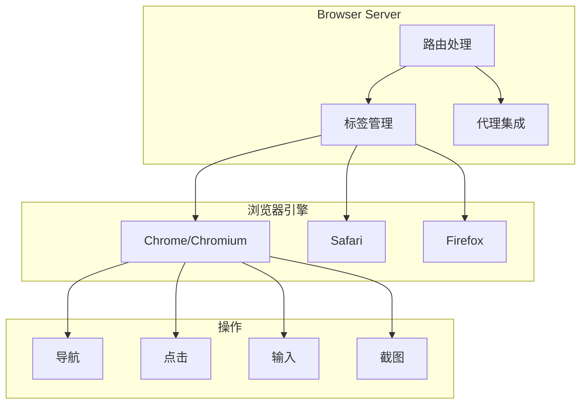

# Browser 浏览器

Browser 模块提供浏览器自动化能力，支持网页导航、表单填写、截图等操作。

## 概述



## 架构设计

### 服务结构

```typescript
interface BrowserServer {
  // 标签管理
  tabs: TabManager;

  // 路由注册
  routes: BrowserRoutes;

  // 代理集成
  agent: BrowserAgentIntegration;
}
```

### 路由结构

```
/browser/
├── basic/      # 基础操作
│   ├── navigate
│   ├── screenshot
│   └── wait
├── tabs/       # 标签管理
│   ├── create
│   ├── close
│   └── switch
└── agent/      # 代理集成
    ├── execute
    └── query
```

## 基础操作

### 导航

```typescript
interface NavigateParams {
  url: string;
  timeout?: number;
  waitUntil?: 'load' | 'domcontentloaded' | 'networkidle';
}

// 示例
await browser.navigate({
  url: 'https://example.com',
  waitUntil: 'networkidle'
});
```

### 点击

```typescript
interface ClickParams {
  selector: string;
  timeout?: number;
  button?: 'left' | 'right' | 'middle';
  clickCount?: number;
}

// 示例
await browser.click({
  selector: 'button.submit',
  timeout: 5000
});
```

### 输入

```typescript
interface TypeParams {
  selector: string;
  text: string;
  delay?: number;
  clear?: boolean;
}

// 示例
await browser.type({
  selector: 'input[name="email"]',
  text: 'user@example.com',
  clear: true
});
```

### 截图

```typescript
interface ScreenshotParams {
  selector?: string;
  fullPage?: boolean;
  format?: 'png' | 'jpeg';
}

// 示例
const screenshot = await browser.screenshot({
  fullPage: true
});
```

## 标签管理

### 创建标签

```typescript
interface CreateTabParams {
  url?: string;
  active?: boolean;
}

const tabId = await browser.tabs.create({
  url: 'https://example.com',
  active: true
});
```

### 切换标签

```typescript
await browser.tabs.switch(tabId);
```

### 关闭标签

```typescript
await browser.tabs.close(tabId);
```

### 标签列表

```typescript
const tabs = await browser.tabs.list();
// [{ id: 'tab-1', url: 'https://...', title: '...' }, ...]
```

## 代理集成

### Agent 工具

代理可以调用浏览器工具：

```typescript
const browserTools = [
  'browser_navigate',
  'browser_click',
  'browser_type',
  'browser_screenshot',
  'browser_scroll',
  'browser_wait',
  'browser_evaluate'
];
```

### 工具定义

```typescript
const browserNavigateTool: ToolDefinition = {
  name: 'browser_navigate',
  description: '导航到指定 URL',
  parameters: {
    url: { type: 'string', description: '目标 URL' },
    waitUntil: { type: 'string', enum: ['load', 'networkidle'] }
  }
};
```

## 高级功能

### 页面等待

```typescript
interface WaitParams {
  // 等待选择器
  selector?: string;

  // 等待超时
  timeout?: number;

  // 等待条件
  condition?: {
    type: 'selector' | 'function' | 'timeout';
    value: string | number;
  };
}

// 等待元素出现
await browser.wait({
  selector: '.result-item',
  timeout: 10000
});
```

### JavaScript 执行

```typescript
interface EvaluateParams {
  script: string;
  args?: unknown[];
}

// 执行 JavaScript
const result = await browser.evaluate({
  script: 'document.title'
});
```

### 文件上传

```typescript
interface UploadParams {
  selector: string;
  files: string[];  // 文件路径
}

await browser.upload({
  selector: 'input[type="file"]',
  files: ['/path/to/file.pdf']
});
```

## 使用示例

### 网页抓取

```typescript
// 导航到页面
await browser.navigate({ url: 'https://example.com' });

// 等待内容加载
await browser.wait({ selector: '.content' });

// 获取内容
const content = await browser.evaluate({
  script: 'document.querySelector(".content").textContent'
});

// 截图
await browser.screenshot({ fullPage: true });
```

### 表单填写

```typescript
// 导航到登录页
await browser.navigate({ url: 'https://example.com/login' });

// 填写表单
await browser.type({
  selector: 'input[name="email"]',
  text: 'user@example.com'
});

await browser.type({
  selector: 'input[name="password"]',
  text: 'password123'
});

// 提交表单
await browser.click({ selector: 'button[type="submit"]' });

// 等待登录完成
await browser.wait({ selector: '.dashboard' });
```

### 多标签操作

```typescript
// 在新标签打开链接
const tab2 = await browser.tabs.create({
  url: 'https://example.com/page2'
});

// 切换到新标签
await browser.tabs.switch(tab2);

// 在新标签执行操作
await browser.screenshot();

// 关闭新标签，返回原标签
await browser.tabs.close(tab2);
```

## 配置

### 浏览器选项

```typescript
interface BrowserConfig {
  // 浏览器类型
  browser?: 'chrome' | 'safari' | 'firefox';

  // 无头模式
  headless?: boolean;

  // 视窗大小
  viewport?: {
    width: number;
    height: number;
  };

  // 用户代理
  userAgent?: string;

  // 代理设置
  proxy?: {
    server: string;
    username?: string;
    password?: string;
  };
}
```

### 配置示例

```json
{
  "browser": {
    "browser": "chrome",
    "headless": true,
    "viewport": {
      "width": 1920,
      "height": 1080
    }
  }
}
```

## 安全考虑

### 沙箱隔离

浏览器在沙箱环境中运行：

- 禁用文件系统访问
- 限制网络请求
- 隔离 Cookie 和存储

### 敏感操作审批

敏感操作需要用户确认：

- 文件上传
- 表单提交
- 支付相关操作

### 资源限制

- 页面超时限制
- 内存使用限制
- 网络请求限制