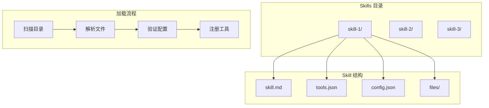

# Skills 技能

Skills 是可复用的能力模块，扩展代理的功能和行为。

## 概述



## Skill 结构

### 目录布局

```
~/.openclaw/skills/
├── my-skill/
│   ├── skill.md        # 提示词/指令
│   ├── tools.json      # 工具定义
│   ├── config.json     # Skill 配置
│   └── files/          # 附加文件
│       ├── template.txt
│       └── examples.md
└── another-skill/
    └── ...
```

### skill.md

Skill 的核心提示词：

```markdown
# My Skill

你是一个专业的代码审查助手。

## 职责

- 审查代码质量
- 提出改进建议
- 检查安全问题

## 输出格式

请以以下格式输出审查结果：

### 问题列表
- [问题类型] 问题描述

### 改进建议
1. 建议1
2. 建议2
```

### tools.json

定义 Skill 提供的工具：

```json
{
  "tools": [
    {
      "name": "review_code",
      "description": "审查代码片段",
      "parameters": {
        "code": {
          "type": "string",
          "description": "要审查的代码"
        },
        "language": {
          "type": "string",
          "description": "编程语言"
        }
      }
    }
  ]
}
```

### config.json

Skill 配置：

```json
{
  "name": "code-reviewer",
  "version": "1.0.0",
  "description": "代码审查技能",
  "author": "OpenClaw",
  "requires": {
    "tools": ["read_file", "write_file"]
  }
}
```

## Skill 管理

### 安装 Skill

```bash
# 从本地目录安装
openclaw skills install ./my-skill

# 从 Git 仓库安装
openclaw skills install https://github.com/user/skill-repo

# 从 Clawhub 安装
openclaw skills install skill-name
```

### 列出 Skills

```bash
# 列出已安装的 Skills
openclaw skills list

# 查看 Skill 详情
openclaw skills show skill-name
```

### 更新 Skill

```bash
# 更新指定 Skill
openclaw skills update skill-name

# 更新所有 Skills
openclaw skills update --all
```

### 删除 Skill

```bash
openclaw skills remove skill-name
```

## 代理配置

### 启用 Skills

在代理配置中启用特定 Skills：

```json
{
  "agents": {
    "list": [
      {
        "id": "coder",
        "skills": [
          "code-reviewer",
          "test-generator"
        ]
      }
    ]
  }
}
```

### 默认 Skills

配置默认启用的 Skills：

```json
{
  "agents": {
    "defaults": {
      "skills": ["general-helper"]
    }
  }
}
```

## 工具定义

### 基本结构

```typescript
interface ToolDefinition {
  name: string;
  description: string;
  parameters: ToolParameters;
  execute?: string;  // 执行脚本
}

interface ToolParameters {
  [key: string]: {
    type: 'string' | 'number' | 'boolean' | 'object' | 'array';
    description: string;
    required?: boolean;
    enum?: string[];
    default?: unknown;
  };
}
```

### 示例工具

```json
{
  "name": "analyze_data",
  "description": "分析数据并生成报告",
  "parameters": {
    "data": {
      "type": "string",
      "description": "要分析的数据",
      "required": true
    },
    "format": {
      "type": "string",
      "description": "输出格式",
      "enum": ["json", "markdown", "csv"],
      "default": "markdown"
    }
  }
}
```

## 内置 Skills

### general-helper

通用助手技能：

- 基础对话能力
- 信息查询
- 任务规划

### code-assistant

代码助手技能：

- 代码生成
- 代码解释
- 错误修复

## 创建自定义 Skill

### 1. 创建目录

```bash
mkdir -p ~/.openclaw/skills/my-skill
```

### 2. 编写提示词

创建 `skill.md`：

```markdown
# My Custom Skill

你是一个专业的 [领域] 助手。

## 能力

1. 能力1
2. 能力2

## 行为准则

- 准则1
- 准则2
```

### 3. 定义工具（可选）

创建 `tools.json`：

```json
{
  "tools": [
    {
      "name": "my_tool",
      "description": "工具描述",
      "parameters": {
        "input": {
          "type": "string",
          "description": "输入参数"
        }
      }
    }
  ]
}
```

### 4. 配置 Skill

创建 `config.json`：

```json
{
  "name": "my-skill",
  "version": "1.0.0",
  "description": "我的自定义技能"
}
```

### 5. 使用 Skill

在代理配置中启用：

```json
{
  "agents": {
    "list": [
      {
        "id": "assistant",
        "skills": ["my-skill"]
      }
    ]
  }
}
```

## 高级用法

### Skill 组合

多个 Skills 可以组合使用：

```json
{
  "skills": [
    "code-reviewer",    # 代码审查
    "test-generator",   # 测试生成
    "doc-writer"        # 文档编写
  ]
}
```

### 条件启用

根据场景启用不同 Skills：

```typescript
// 开发场景
const devSkills = ['code-reviewer', 'debug-helper'];

// 生产场景
const prodSkills = ['monitor', 'alert-handler'];
```

### 动态加载

运行时动态加载 Skill：

```typescript
await agent.loadSkill('dynamic-skill');
```

## Clawhub 集成

### 发布 Skill

将 Skill 发布到 Clawhub：

```bash
openclaw skills publish my-skill
```

### 搜索 Skill

搜索社区 Skills：

```bash
openclaw skills search "code review"
```

### 安装社区 Skill

```bash
openclaw skills install community/skill-name
```

## 最佳实践

### 提示词设计

- 清晰定义角色和能力
- 提供具体的使用示例
- 说明输出格式

### 工具设计

- 单一职责原则
- 清晰的参数说明
- 合理的默认值

### 版本管理

- 使用语义化版本
- 维护变更日志
- 提供升级指南