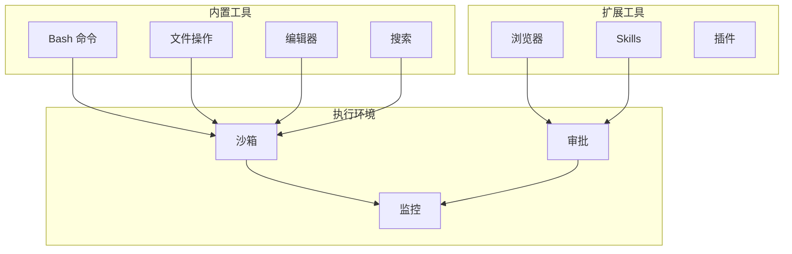
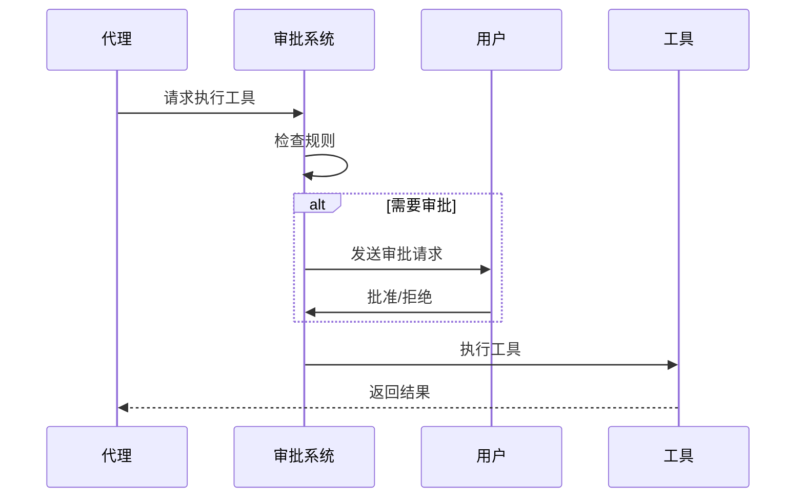

# Tools 工具

OpenClaw 提供丰富的内置工具，支持文件操作、命令执行、网络请求等功能。

## 概述



## 工具类型

### Bash 工具

执行 shell 命令：

```typescript
interface BashTool {
  name: 'bash';
  description: '执行 shell 命令';
  parameters: {
    command: string;
    timeout?: number;
    workdir?: string;
    env?: Record<string, string>;
  };
}
```

#### 使用示例

```typescript
// 执行简单命令
await tools.bash({ command: 'ls -la' });

// 指定工作目录
await tools.bash({
  command: 'npm test',
  workdir: '/path/to/project'
});

// 设置环境变量
await tools.bash({
  command: 'node script.js',
  env: { NODE_ENV: 'production' }
});
```

#### 安全机制

- **命令白名单**: 限制可执行的命令
- **沙箱隔离**: 在隔离环境中执行
- **超时保护**: 防止长时间运行
- **审批机制**: 敏感命令需要确认

### 文件工具

#### read_file

读取文件内容：

```typescript
await tools.read_file({
  path: '/path/to/file.txt',
  offset: 0,
  limit: 100
});
```

#### write_file

写入文件内容：

```typescript
await tools.write_file({
  path: '/path/to/file.txt',
  content: 'Hello, World!'
});
```

#### edit_file

编辑文件：

```typescript
await tools.edit_file({
  path: '/path/to/file.txt',
  old_string: 'old content',
  new_string: 'new content'
});
```

#### list_files

列出目录文件：

```typescript
await tools.list_files({
  path: '/path/to/dir',
  pattern: '**/*.ts'
});
```

### 搜索工具

#### grep

搜索文件内容：

```typescript
await tools.grep({
  pattern: 'function\\s+\\w+',
  path: '/path/to/dir',
  type: 'ts'
});
```

#### glob

文件模式匹配：

```typescript
await tools.glob({
  pattern: '**/*.test.ts',
  path: '/path/to/project'
});
```

### 网络工具

#### fetch

HTTP 请求：

```typescript
await tools.fetch({
  url: 'https://api.example.com/data',
  method: 'GET',
  headers: { 'Authorization': 'Bearer token' }
});
```

#### web_search

网络搜索：

```typescript
await tools.web_search({
  query: 'OpenClaw documentation',
  limit: 10
});
```

## 工具配置

### 启用/禁用工具

```json
{
  "agents": {
    "list": [
      {
        "id": "assistant",
        "tools": {
          "enabled": ["bash", "read_file", "write_file"],
          "disabled": ["web_search"]
        }
      }
    ]
  }
}
```

### 工具限制

```json
{
  "tools": {
    "bash": {
      "timeout": 30000,
      "allowCommands": ["git", "npm", "node"],
      "denyCommands": ["rm -rf /"]
    }
  }
}
```

## 执行审批

### 审批流程



### 审批规则

```typescript
interface ApprovalRule {
  // 工具名称
  tool: string;

  // 匹配条件
  condition: {
    command?: string;      // 命令模式
    path?: string;         // 路径模式
  };

  // 审批要求
  require: 'always' | 'once' | 'never';
}
```

### 配置示例

```json
{
  "tools": {
    "approvals": [
      {
        "tool": "bash",
        "condition": { "command": "rm *" },
        "require": "always"
      },
      {
        "tool": "bash",
        "condition": { "command": "git *" },
        "require": "once"
      }
    ]
  }
}
```

## 沙箱环境

### 沙箱配置

```typescript
interface SandboxConfig {
  // 工作目录
  workdir: string;

  // 允许的命令
  allowCommands?: string[];

  // 禁止的命令
  denyCommands?: string[];

  // 环境变量
  env?: Record<string, string>;

  // 超时时间
  timeout?: number;

  // 资源限制
  limits?: {
    memory?: number;
    cpu?: number;
  };
}
```

### 使用示例

```json
{
  "sandbox": {
    "workdir": "/workspace",
    "allowCommands": ["npm", "node", "git"],
    "timeout": 60000
  }
}
```

## 自定义工具

### 定义工具

```typescript
const myTool: ToolDefinition = {
  name: 'my_custom_tool',
  description: '自定义工具描述',
  parameters: {
    input: {
      type: 'string',
      description: '输入参数'
    }
  },
  execute: async (params) => {
    // 工具实现
    return { result: 'success' };
  }
};
```

### 注册工具

```typescript
// 注册到代理
agent.registerTool(myTool);

// 或通过配置文件
{
  "tools": {
    "custom": [
      {
        "name": "my_tool",
        "script": "/path/to/tool.js"
      }
    ]
  }
}
```

## 工具目录

### 查询可用工具

```bash
# CLI 查询
openclaw tools catalog

# Gateway API
await gateway.request({
  method: 'tools.catalog',
  params: {}
});
```

### 工具分类

| 类别 | 工具 | 描述 |
|------|------|------|
| 文件 | read_file | 读取文件 |
| 文件 | write_file | 写入文件 |
| 文件 | edit_file | 编辑文件 |
| 文件 | list_files | 列出文件 |
| 执行 | bash | 执行命令 |
| 搜索 | grep | 内容搜索 |
| 搜索 | glob | 文件匹配 |
| 网络 | fetch | HTTP 请求 |
| 网络 | web_search | 网络搜索 |
| 浏览器 | browser_* | 浏览器操作 |

## 最佳实践

### 安全优先

- 使用最小权限原则
- 敏感操作需要审批
- 定期审计工具使用

### 错误处理

```typescript
try {
  const result = await tools.bash({ command: '...' });
} catch (error) {
  // 处理错误
  console.error('Tool execution failed:', error);
}
```

### 性能优化

- 批量操作合并请求
- 使用缓存减少重复计算
- 设置合理的超时时间